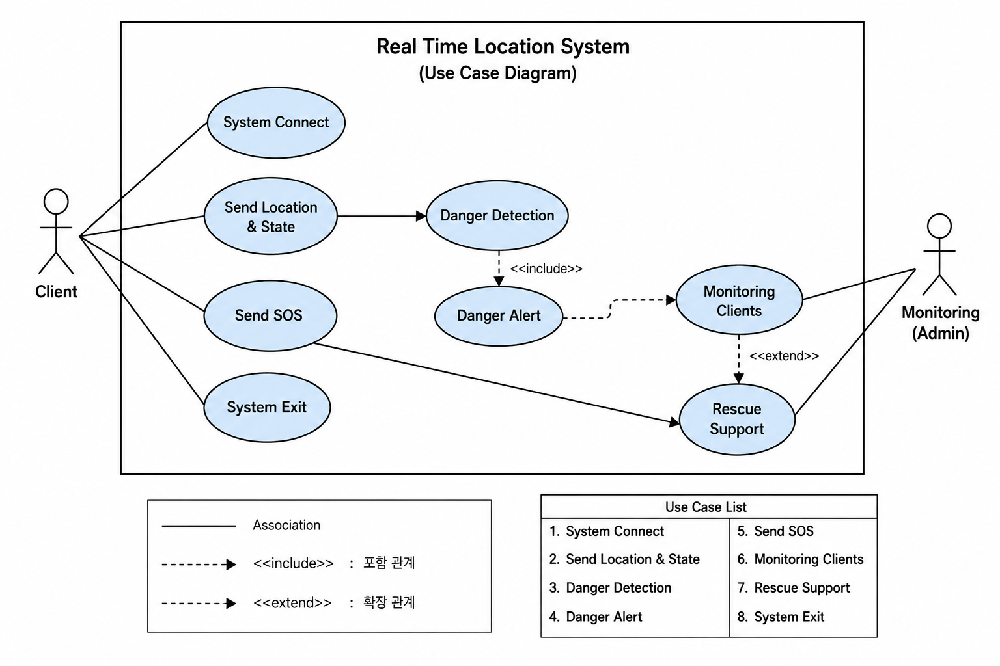
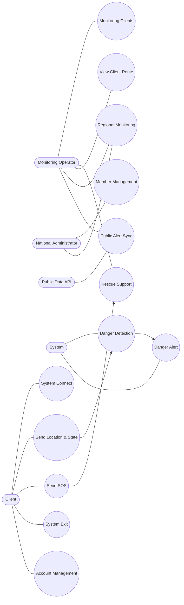
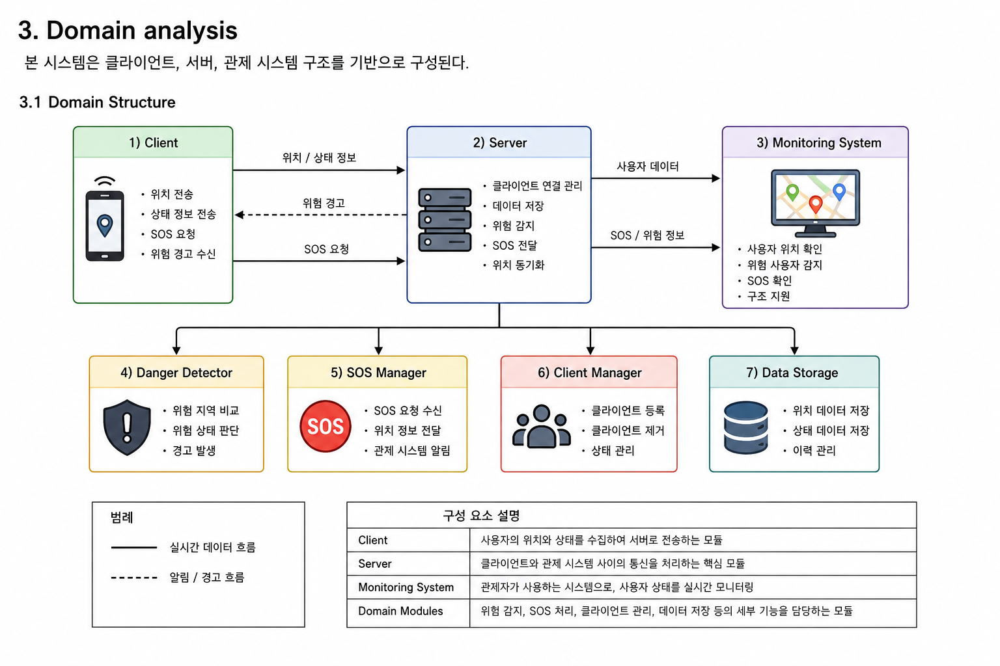
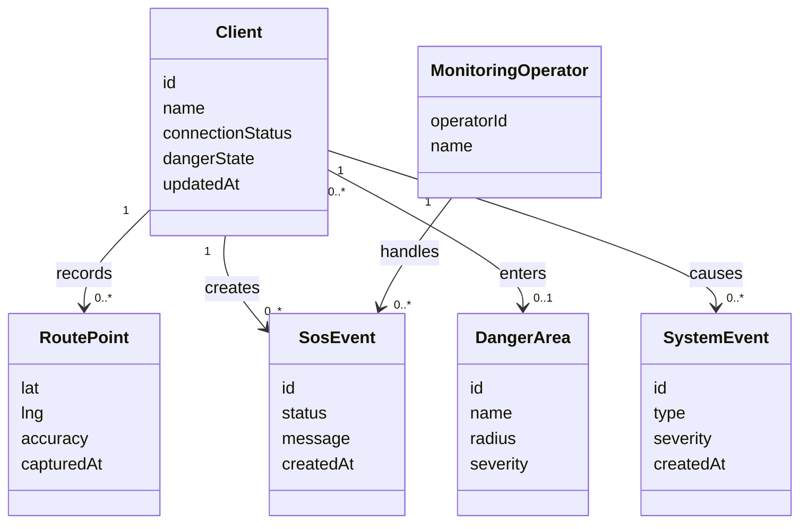
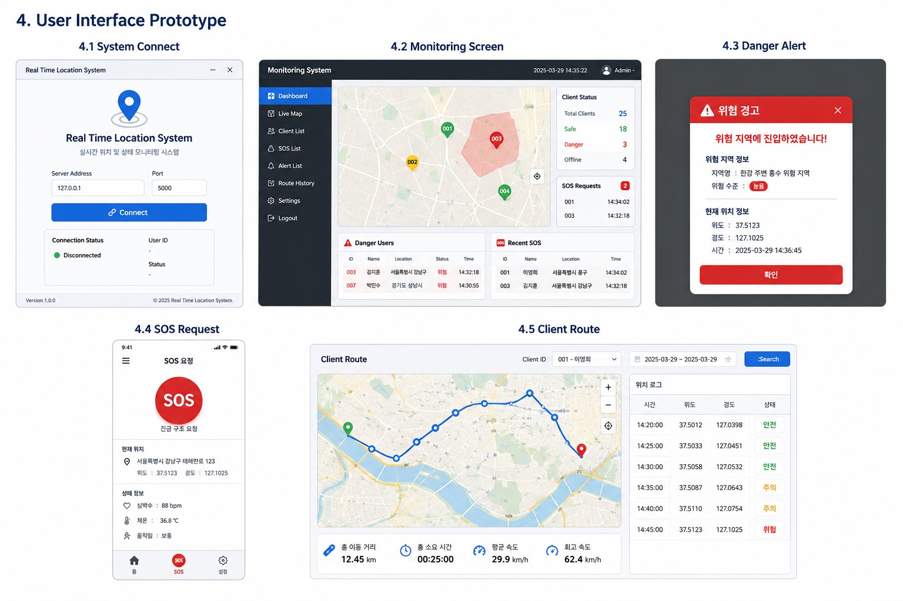

<!-- 22212023 컴퓨터공학과 김지훈 -->
<!-- GitHub Repository : https://github.com/xweoze/real-time-monitoring-system -->

# Real Time Location System

## Analysis Document

---

# [ Revision history ]

| Revision date | Version # | Description | Author |
|---|---|---|---|
| 2026-03-27 | 0.01 | First Documentation | 김지훈 |
| 2026-03-28 | 0.02 | Use case 수정 및 추가 | 김지훈 |
| 2026-03-29 | 1.00 | Analysis Document 작성 | 김지훈 |
| 2026-06-11 | 1.10 | Use Case, Domain Model, 자료구조 및 알고리즘 보완 | 김지훈 |
| 2026-06-11 | 1.20 | 예외 흐름, 비기능 요구사항 및 추적성 보완 | 김지훈 |
| 2026-06-13 | 1.30 | 인증, 지역 권한, 회원 관리와 공공 알림 분석 반영 | 김지훈 |

---

# [ Contents ]

1. Introduction
2. Use case analysis
3. Domain analysis
4. User Interface Prototype
5. Nonfunctional Requirements
6. Requirements Traceability
7. Glossary
8. References

---

# 1. Introduction

본 문서는 Conceptualization 단계에서 정의한  
“재난 상황 취약계층 실시간 위치 및 상태 모니터링 시스템”에 대한  
Analysis 단계 문서이다.

본 단계에서는 시스템이 실제로 어떤 방식으로 동작하는지에 대한  
Use Case 분석, Domain 구조 분석, 사용자 인터페이스 설계를 중심으로 기술한다.

---

## 1.1 Summary

최근 자연재해, 전쟁, 화재, 붕괴 사고와 같은 재난 상황이 증가하면서  
취약계층의 신속한 구조와 위치 파악의 중요성이 커지고 있다.

특히 노인, 여성, 아동, 장애인과 같은 취약계층은  
위험 상황 발생 시 대처 능력이 상대적으로 부족하며,  
구조 인력이 위치를 빠르게 파악하지 못하면  
생명에 직접적인 위험이 발생할 수 있다.

따라서 본 시스템은 다음과 같은 목적을 가진다.

- 사용자의 위치와 상태를 실시간으로 수집
- 위험 지역 진입 여부 자동 감지
- SOS 요청 기능 제공
- 관제 시스템을 통한 중앙 모니터링
- 구조 지원 및 위험 대응 시간 최소화

이를 통해 재난 상황에서도  
빠르고 효율적인 구조 지원이 가능하도록 한다.

---

## 1.2 Business Goals

- 취약계층의 위치를 실시간으로 모니터링 할 수 있어야 한다.
- 위험 지역 진입 여부를 자동으로 감지할 수 있어야 한다.
- 긴급 상황 시 SOS 요청 기능을 제공해야 한다.
- 관제자가 사용자 상태를 중앙에서 확인할 수 있어야 한다.
- 위험 상황 발생 시 빠르게 대응할 수 있어야 한다.
- 사용자 이동 경로를 추적 및 분석할 수 있어야 한다.

---

## 1.3 Technical Goals

- HTTP와 JSON을 이용해 클라이언트와 서버 간 안정적인 통신이 가능해야 한다.
- 실시간 위치 데이터를 빠르게 처리할 수 있어야 한다.
- 다수의 클라이언트를 동시에 처리할 수 있어야 한다.
- 위험 지역 감지 알고리즘이 정확해야 한다.
- SOS 요청이 지연 없이 전달되어야 한다.
- 멀티스레드 HTTP 처리와 SSE 기반 이벤트 전달을 통해 동시성과 실시간성을 보장해야 한다.
- 사용자 ID 기반 조회 및 갱신은 평균 `O(1)` 시간에 처리할 수 있어야 한다.
- 위치 및 이벤트 이력은 최대 저장 개수를 제한하여 메모리 사용량을 제어해야 한다.
- heartbeat를 통해 비정상 종료 사용자를 자동으로 오프라인 처리해야 한다.
- SQLite 저장소를 통해 서버 재시작 후 상태를 복구할 수 있어야 한다.
- 사용자·전국 관리자·지역 관리자 역할에 따라 API 접근 범위를 제한해야 한다.
- 지역별 사용자 조회는 `regionId → clientId 집합` 인덱스로 효율적으로 처리해야 한다.
- 기관별 공공데이터 응답을 내부 표준 알림 형식으로 변환해야 한다.
- 회원 삭제 시 세션과 연결된 관제 데이터를 함께 정리해야 한다.

---

# 2. Use case analysis

---

## 2.1 Use Case Diagram



<div align="center">
  <sub>[Figure 2-1] Use Case Diagram</sub>
</div>

### Revised Use Case Structure



### Actor

- Client
- Monitoring Operator(Admin)
- National Administrator
- Regional Operator
- External Public Data API

---

### Use Case List

- System Connect
- Send Location & State
- Danger Detection
- Danger Alert
- Send SOS
- Monitoring Clients
- Rescue Support
- View Client Route
- System Exit
- Account Management
- Member Management
- Regional Monitoring
- Public Alert Synchronization

---

## 2.2 Use Case Description

---

# Use case #1 : System Connect

## GENERAL CHARACTERISTICS

| Item | Description |
|---|---|
| Summary | 사용자가 회원가입 또는 로그인 후 자신의 계정과 연결된 단말로 시스템에 접속한다. |
| Scope | Real Time Location System |
| Level | User Level |
| Primary Actor | Client |
| Preconditions | 시스템 서버가 실행 중이어야 한다. |
| Trigger | 사용자가 인증을 완료하고 서비스 연결을 실행한다. |
| Success Post Condition | 계정 ID와 관제 단말 ID가 연결되고 heartbeat가 시작된다. |
| Failed Post Condition | 시스템 연결 실패 메시지를 출력한다. |

---

## MAIN SUCCESS SCENARIO

| Step | Action |
|---|---|
| 1 | 사용자가 웹 앱에서 회원가입 또는 로그인을 수행한다. |
| 2 | 서버가 PBKDF2 비밀번호 해시를 검증하고 12시간 세션을 발급한다. |
| 3 | 사용자가 서비스 연결을 실행하면 서버가 기존 단말을 복구하거나 새 단말을 등록한다. |
| 4 | 서버가 계정 프로필과 지역 정보를 단말 상태에 동기화한다. |
| 5 | heartbeat와 위치 공유가 시작되고 관제 화면에 반영된다. |

---

## EXTENSION SCENARIOS

| Step | Branching Action |
|---|---|
| 2 | 서버 연결 실패 시 오류 메시지를 표시하고 사용자가 다시 시도할 수 있게 한다. |
| 3 | 잘못된 요청 데이터이면 서버가 오류 응답을 반환한다. |

---

# Use case #2 : Send Location & State

## GENERAL CHARACTERISTICS

| Item | Description |
|---|---|
| Summary | 사용자가 자신의 위치 및 상태를 서버로 전송한다. |
| Scope | Real Time Location System |
| Level | User Level |
| Primary Actor | Client |
| Preconditions | 서버와 연결된 상태여야 한다. |
| Trigger | 사용자가 위치 조회 또는 위치 전송을 실행한다. |
| Success Post Condition | 위치 및 상태 정보가 서버에 저장된다. |
| Failed Post Condition | 위치 전송 실패 메시지를 출력한다. |

---

## MAIN SUCCESS SCENARIO

| Step | Action |
|---|---|
| 1 | 사용자가 현재 위치 조회 또는 위치 전송을 선택한다. |
| 2 | 클라이언트가 브라우저 위치 정보 또는 입력 좌표로 위치 데이터를 생성한다. |
| 3 | 위치 및 상태 정보를 서버로 전송한다. |
| 4 | 서버가 데이터를 저장한다. |

---

## EXTENSION SCENARIOS

| Step | Branching Action |
|---|---|
| 2 | 위치 권한이 없으면 사용자가 직접 입력한 좌표를 사용한다. |
| 3 | 위도 또는 경도가 허용 범위를 벗어나면 서버가 요청을 거부한다. |
| 3 | 저장된 사용자 세션이 서버에 없으면 다시 연결하도록 안내한다. |

---

# Use case #3 : Danger Detection

## GENERAL CHARACTERISTICS

| Item | Description |
|---|---|
| Summary | 시스템이 위험 지역 진입 여부를 감지한다. |
| Scope | Real Time Location System |
| Level | System Level |
| Primary Actor | System |
| Preconditions | 위치 데이터가 수신되어야 한다. |
| Trigger | 사용자의 위치가 변경된다. |
| Success Post Condition | 위험 상태 여부를 판단한다. |
| Failed Post Condition | 위험 지역 분석 실패 |

---

## MAIN SUCCESS SCENARIO

| Step | Action |
|---|---|
| 1 | 서버가 위치 데이터를 수신한다. |
| 2 | 위험 지역 데이터와 비교한다. |
| 3 | 위험 여부를 판단한다. |
| 4 | 위험 상태를 사용자에게 전달한다. |

---

## EXTENSION SCENARIOS

| Step | Branching Action |
|---|---|
| 2 | 등록된 위험 지역이 없으면 사용자를 안전 상태로 유지한다. |
| 3 | 여러 위험 지역이 겹치면 심각도가 가장 높은 지역을 선택한다. |
| 3 | 위험 지역 경계에서 위치가 반복 변동하면 향후 히스테리시스 정책을 적용한다. |

---

# Use case #4 : Danger Alert

## GENERAL CHARACTERISTICS

| Item | Description |
|---|---|
| Summary | 위험 지역 진입 시 사용자에게 경고한다. |
| Scope | Real Time Location System |
| Level | System Level |
| Primary Actor | System |
| Preconditions | 위험 상태가 감지되어야 한다. |
| Trigger | 위험 지역 진입 |
| Success Post Condition | 경고 메시지가 전달된다. |
| Failed Post Condition | 경고 전송 실패 |

---

## MAIN SUCCESS SCENARIO

| Step | Action |
|---|---|
| 1 | 시스템이 위험 상태를 감지한다. |
| 2 | 클라이언트에게 경고 메시지를 전송한다. |
| 3 | 관제 시스템에도 위험 상태를 전달한다. |

---

## EXTENSION SCENARIOS

| Step | Branching Action |
|---|---|
| 2 | 사용자 화면이 닫혀 있으면 현재 MVP에서는 경고를 표시할 수 없다. |
| 3 | 관제 SSE 연결이 끊기면 브라우저가 재연결하고 최신 상태를 다시 조회한다. |

---

# Use case #5 : Send SOS

## GENERAL CHARACTERISTICS

| Item | Description |
|---|---|
| Summary | 사용자가 긴급 구조 요청을 보낸다. |
| Scope | Real Time Location System |
| Level | User Level |
| Primary Actor | Client |
| Preconditions | 서버와 연결된 상태여야 한다. |
| Trigger | 사용자가 SOS 버튼 클릭 |
| Success Post Condition | SOS 요청이 전달된다. |
| Failed Post Condition | SOS 요청 실패 |

---

## MAIN SUCCESS SCENARIO

| Step | Action |
|---|---|
| 1 | 사용자가 SOS 버튼을 누른다. |
| 2 | 클라이언트가 SOS 데이터를 생성한다. |
| 3 | 서버로 SOS 요청을 전송한다. |
| 4 | 서버가 관제 시스템으로 전달한다. |

---

## EXTENSION SCENARIOS

| Step | Branching Action |
|---|---|
| 1 | 3초 전에 버튼에서 손을 떼면 SOS를 생성하지 않는다. |
| 3 | 사용자의 최신 위치가 없으면 위치를 먼저 전송하도록 안내한다. |
| 3 | 서버 연결이 초기화되었으면 다시 등록하도록 안내한다. |

---

# Use case #6 : Monitoring Clients

## GENERAL CHARACTERISTICS

| Item | Description |
|---|---|
| Summary | 관제자가 사용자 위치와 상태를 실시간 모니터링 한다. |
| Scope | Real Time Location System |
| Level | Admin Level |
| Primary Actor | Monitoring Operator |
| Preconditions | 사용자가 서버에 접속되어 있어야 한다. |
| Trigger | 관제 시스템 실행 |
| Success Post Condition | 사용자 상태를 실시간 확인 가능 |
| Failed Post Condition | 사용자 데이터 확인 실패 |

---

## MAIN SUCCESS SCENARIO

| Step | Action |
|---|---|
| 1 | 관제 시스템이 서버에 연결된다. |
| 2 | 서버가 사용자 데이터를 전송한다. |
| 3 | 관제자가 사용자 상태를 확인한다. |

---

## EXTENSION SCENARIOS

| Step | Branching Action |
|---|---|
| 1 | SSE 연결이 끊기면 연결 상태를 재연결 중으로 표시한다. |
| 2 | 사용자가 없으면 빈 상태 안내를 표시한다. |
| 3 | 마지막 위치 측정 후 60초가 지나면 관제 화면에 `STALE LOCATION`을 표시한다. |

---

# Use case #7 : Rescue Support

## GENERAL CHARACTERISTICS

| Item | Description |
|---|---|
| Summary | 관제자가 구조 지원을 수행한다. |
| Scope | Real Time Location System |
| Level | Admin Level |
| Primary Actor | Monitoring Operator |
| Preconditions | 위험 상황이 발생해야 한다. |
| Trigger | SOS 요청 또는 위험 감지 |
| Success Post Condition | 구조 지원 수행 |
| Failed Post Condition | 구조 지원 실패 |

---

## MAIN SUCCESS SCENARIO

| Step | Action |
|---|---|
| 1 | 관제자가 위험 상황을 확인한다. |
| 2 | 구조 인력에게 위치 정보를 전달한다. |
| 3 | 구조 요청을 처리한다. |

---

## EXTENSION SCENARIOS

| Step | Branching Action |
|---|---|
| 1 | SOS 이벤트를 찾을 수 없으면 처리 요청을 거부한다. |
| 3 | 현재 상태에서 허용되지 않는 SOS 상태 전이는 서버가 오류 응답으로 거부한다. |
| 3 | 현재 MVP의 구조 처리는 대시보드 내부 상태 변경이며 실제 구조기관 신고가 아니다. |

---

# Use case #8 : View Client Route

## GENERAL CHARACTERISTICS

| Item | Description |
|---|---|
| Summary | 관제자가 특정 사용자의 위치 기록과 이동 경로를 조회한다. |
| Scope | Real Time Location System |
| Level | Admin Level |
| Primary Actor | Monitoring Operator |
| Preconditions | 사용자가 한 번 이상 위치 정보를 전송해야 한다. |
| Trigger | 관제자가 사용자 상세 화면에서 이동 경로 조회를 선택한다. |
| Success Post Condition | 시간순 위치 기록이 지도 위 경로로 표시된다. |
| Failed Post Condition | 위치 기록을 찾을 수 없거나 경로 조회에 실패한다. |

---

## MAIN SUCCESS SCENARIO

| Step | Action |
|---|---|
| 1 | 관제자가 모니터링 화면에서 사용자를 선택한다. |
| 2 | 관제 시스템이 서버에 해당 사용자의 경로를 요청한다. |
| 3 | 서버가 시간순 위치 기록을 반환한다. |
| 4 | 관제 시스템이 위치 지점을 연결하여 이동 경로를 표시한다. |

---

## EXTENSION SCENARIOS

| Step | Branching Action |
|---|---|
| 3 | 위치 기록이 없으면 경로가 없다는 안내를 표시한다. |
| 3 | 존재하지 않는 사용자 ID이면 사용자 조회 실패 메시지를 표시한다. |

---

# Use case #9 : System Exit

## GENERAL CHARACTERISTICS

| Item | Description |
|---|---|
| Summary | 사용자가 시스템 접속을 종료한다. |
| Scope | Real Time Location System |
| Level | User Level |
| Primary Actor | Client |
| Preconditions | 시스템 접속 상태 |
| Trigger | 사용자가 종료 버튼 클릭 |
| Success Post Condition | 서버 연결 종료 |
| Failed Post Condition | 연결 종료 실패 |

---

## MAIN SUCCESS SCENARIO

| Step | Action |
|---|---|
| 1 | 사용자가 종료 버튼을 누른다. |
| 2 | 클라이언트가 종료 메시지를 전송한다. |
| 3 | 서버가 연결을 종료한다. |

---

# Use case #10~#13 : Account, Member, Region and Public Alert Management

| Use Case | Primary Actor | Main Result |
|---|---|---|
| Account Management | Client | 회원가입·로그인·로그아웃과 12시간 세션 관리 |
| Member Management | National / Regional Operator | 권한 범위 안에서 회원 조회·프로필 수정·계정 삭제 |
| Regional Monitoring | National / Regional Operator | 전국 또는 담당 지역의 사용자·SOS·공공 알림 조회 |
| Public Alert Synchronization | System / Public Data API | 기관별 응답을 표준 알림으로 변환하고 지역별 활성 알림 갱신 |

회원 수정 시 계정 프로필과 관제 단말 프로필을 함께 동기화한다. 회원 삭제 시 로그인
세션, 단말, 이동 경로와 관련 SOS를 함께 제거한다. 지역 관리자가 담당 지역 밖의
회원 또는 단말에 접근하는 요청은 서버에서 거부한다.

---

# 3. Domain analysis

본 시스템은 클라이언트, 서버, 관제 시스템을 중심으로 하며 위치, 위험 지역, SOS 및 이벤트 정보를 도메인 객체로 관리한다.

---

## 3.1 Domain Structure


<div align="center">
  <sub>[Figure 3-1] Domain Analysis Diagram</sub>
</div>

### Revised Domain Model



### 1) Client

사용자의 위치와 상태를 서버에 전송하는 모듈이다.

주요 기능

- 위치 전송
- 상태 정보 전송
- SOS 요청
- 위험 경고 수신

---

### 2) Server

클라이언트와 관제 시스템 사이의 통신을 처리하는 핵심 모듈이다.

주요 기능

- 클라이언트 연결 관리
- 데이터 저장
- 위험 감지
- SOS 전달
- 위치 동기화

---

### 3) Monitoring System

관제자가 사용하는 시스템이다.

주요 기능

- 사용자 위치 확인
- 위험 사용자 감지
- SOS 확인
- 구조 지원

---

### 4) Danger Detector

사용자의 위치 데이터를 기반으로 위험 지역 진입 여부를 판단한다.

주요 기능

- 위험 지역 비교
- 위험 상태 판단
- 경고 발생

---

### 5) SOS Manager

사용자의 SOS 요청을 처리하는 모듈이다.

주요 기능

- SOS 요청 수신
- 위치 정보 전달
- 관제 시스템 알림

---

### 6) Client Manager

접속한 사용자 정보를 관리한다.

주요 기능

- 클라이언트 등록
- 클라이언트 제거
- 상태 관리

---

## 3.2 Domain Entities

| Entity | Main Attributes | Responsibility |
|---|---|---|
| Client | `id`, `name`, `deviceId`, `connectionStatus`, `dangerState`, `updatedAt` | 사용자 식별과 최신 접속·안전 상태 관리 |
| Location | `lat`, `lng`, `accuracy`, `capturedAt` | 특정 시점의 사용자 위치 표현 |
| DangerArea | `id`, `name`, `lat`, `lng`, `radius`, `severity` | 원형 위험 지역과 위험도 정의 |
| SosEvent | `id`, `clientId`, `status`, `message`, `location`, `createdAt` | 긴급 구조 요청과 처리 단계 관리 |
| RoutePoint | `clientId`, `location`, `capturedAt` | 사용자별 시간순 이동 경로 구성 |
| SystemEvent | `id`, `type`, `title`, `clientId`, `severity`, `createdAt` | 접속, 위험, SOS 및 구조 처리 이력 기록 |
| UserAccount | `id`, `username`, `passwordHash`, `role`, `regionId`, `birthDate`, `gender` | 로그인 계정, 역할과 회원 프로필 관리 |
| Session | `tokenHash`, `userId`, `expiresAt` | 12시간 Bearer 로그인 세션 관리 |
| MonitoringOperator | `operatorId`, `name`, `role`, `regionId` | SOS 처리와 지역별 관제를 수행하는 운영자 표현 |
| Region | `id`, `name`, `lat`, `lng` | 대한민국 17개 시·도의 관제 범위와 지도 기준점 |
| PublicAlert | `sourceId`, `source`, `regionId`, `severity`, `issuedAt`, `expiresAt` | 기관별 재난·기상 알림의 공통 표현 |

### Entity Relationships

- 한 명의 `Client`는 여러 개의 `Location` 또는 `RoutePoint`를 가진다. (`1:N`)
- 한 명의 `Client`는 여러 개의 `SosEvent`를 생성할 수 있다. (`1:N`)
- 하나의 `DangerArea`에는 여러 사용자가 동시에 진입할 수 있다. (`1:N`)
- 하나의 `MonitoringOperator`는 여러 SOS 이벤트를 처리할 수 있다. (`1:N`)
- 하나의 `UserAccount`는 최대 하나의 현재 관제 `Client`와 연결된다. (`1:0..1`)
- 하나의 `Region`은 여러 사용자, 지역 관리자와 공공 알림을 포함한다. (`1:N`)
- `SystemEvent`는 관련된 `Client` 또는 `SosEvent`의 상태 변화를 기록한다.

---

## 3.3 Data Structure Analysis

| Target Data | Data Structure | Main Operation | Complexity and Reason |
|---|---|---|---|
| Client Registry | Hash Map (`clientId → Client`) | 등록, 조회, 상태 갱신 | 평균 `O(1)`, ID 기반 요청 처리에 적합 |
| User Accounts / Sessions | SQLite Tables | 인증, 역할 확인, 프로필 수정과 세션 만료 | 인덱스 기반 계정 조회와 영구 저장 |
| User Index | Hash Map (`userId → clientId`) | 계정에 연결된 현재 단말 조회 | 평균 `O(1)` |
| Region Index | Hash Map (`regionId → Set[clientId]`) | 지역별 사용자 목록과 집계 | 조회 `O(k)`, 전체 사용자 순회 방지 |
| Route History | Hash Map + Bounded List | 위치 추가, 사용자별 경로 조회 | 조회 `O(k)`, 사용자별 최대 500개 제한 |
| Danger Areas | List | 위치별 위험 지역 비교 | 위험 지역 수를 `d`라 할 때 `O(d)` |
| SOS Events | Hash Map (`sosId → SosEvent`) | 생성, 접수, 완료 갱신 | 평균 `O(1)`, 이벤트 ID 기반 갱신에 적합 |
| Event Timeline | Bounded List | 최신 이벤트 삽입 및 표시 | 최대 100개를 유지해 메모리 증가 방지 |
| SSE Subscribers | List of Queues | 상태 변경 메시지 발행 | 구독자 수를 `s`라 할 때 발행 `O(s)` |
| Public Alerts | Hash Map (`source:id → alert`) | 중복 알림 갱신, 지역·만료 필터 | 평균 갱신 `O(1)`, 조회 `O(a)` |

현재 MVP는 메모리 구조를 주 저장소로 사용하고 전체 상태를 SQLite에 저장하여 재시작 복구를 지원한다. 운영 환경에서는 사용자와 위치 기록을 정규화된 관계형 데이터베이스 또는 시계열 데이터베이스에 저장하고, 위험 지역 검색에는 공간 인덱스를 적용해야 한다.

---

## 3.4 Algorithm Analysis

### 3.4.1 Danger Detection

현재 위험 지역은 중심 위도·경도와 반경으로 구성된 원으로 모델링한다.

1. 사용자의 위도·경도와 위험 지역 중심의 거리를 Haversine 공식으로 계산한다.
2. 계산된 거리가 위험 지역의 반경 이하이면 해당 지역 내부로 판정한다.
3. 여러 위험 지역이 겹치면 `severity` 값이 가장 높은 지역을 선택한다.
4. 이전 상태와 현재 상태가 달라질 때만 위험 진입 또는 안전 복귀 이벤트를 생성한다.

위험 지역이 `d`개일 때 한 번의 위치 갱신에 필요한 시간복잡도는 `O(d)`이다. 위험 지역이 많아지면 R-tree, Quadtree 또는 Geohash로 후보 지역을 먼저 검색하여 성능을 개선할 수 있다.

### 3.4.2 Route Tracking

위치 데이터는 수신 순서에 따라 사용자별 리스트 뒤에 추가한다. 관제 화면은 저장된 지점을 순서대로 연결하여 이동 경로를 표현한다.

- 위치 추가: 일반적으로 `O(1)`, 목록 절단이 발생하면 `O(k)`
- `k`개 경로 조회 및 표시: `O(k)`
- 최대 500개 지점만 유지하여 사용자당 메모리 사용량을 제한

현재 구현은 리스트를 사용한다. 고정 길이 `deque`로 변경하면 오래된 지점 제거를 포함한 위치 추가를 `O(1)`로 유지할 수 있다. 장기 경로를 저장할 경우 Douglas-Peucker 알고리즘으로 의미가 작은 중간 지점을 제거하여 표시 비용을 줄일 수 있다.

### 3.4.3 SOS State Machine

SOS 요청은 다음 상태 머신으로 관리한다.

```text
OPEN → ACKNOWLEDGED → RESOLVED
  └───────────────→ CANCELLED
```

- `OPEN`: 사용자가 SOS를 생성한 상태
- `ACKNOWLEDGED`: 관제자가 구조 요청을 확인하고 접수한 상태
- `RESOLVED`: 구조 지원이 완료된 상태
- `CANCELLED`: 요청이 취소된 상태

현재 시스템은 이전 상태별 허용 전이를 서버에서 검증하여 `OPEN`에서 바로
`RESOLVED`로 변경하는 요청이나 완료된 SOS의 재처리를 거부한다.

### 3.4.4 Real-time Event Delivery

서버는 상태가 변경되면 Publish-Subscribe 방식으로 모든 SSE 구독 큐에 이벤트를 발행한다. 관제 화면은 이벤트를 받으면 최신 상태 스냅샷을 다시 조회해 화면을 갱신한다. 구독자별 제한 큐를 사용하여 특정 연결의 지연이 전체 시스템에 영향을 주는 것을 방지한다.

### 3.4.5 Concurrency Control

여러 요청 스레드가 클라이언트, 경로 및 SOS 정보를 동시에 변경할 수 있으므로 공유 저장소에 재진입 가능한 Lock을 적용한다. 이를 통해 위치 갱신과 SOS 생성 중 데이터가 불완전한 상태로 조회되는 경쟁 조건을 방지한다.

### 3.4.6 Regional Indexing and Orphan Cleanup

지역별 조회는 `regionId → set[clientId]` 인덱스를 사용하여 대상 사용자만 선택한다.
서버 시작 시 실제 `USER` 계정 ID 집합을 만든 뒤 회원 ID가 없거나 집합에 포함되지
않는 과거 단말을 제거한다. 회원 수를 `u`, 단말 수를 `c`라 할 때 정리 비용은
집합 조회를 사용해 `O(u + c)`이다.

### 3.4.7 Public Data Normalization

기관별 JSON, XML 또는 텍스트 응답을 공급자 어댑터가 공통 `PublicAlert` 구조로
변환한다. 지역명은 내부 `KR-*` 코드로 매핑하고, 동일한 `source + sourceId`는
덮어써 중복을 방지한다. 만료 시각이 지난 알림은 조회 결과에서 제외한다.

---

# 4. User Interface Prototype


<div align="center">
  <sub>[Figure 4-1] User Interface Prototype</sub>
</div>

---

## 4.1 System Connect

프로그램 실행 시 사용자는 회원가입 또는 로그인 후 위치 공유 서비스에 연결한다.

화면 구성

- 로그인·회원가입 탭
- 생년월일·성별·거주 지역 선택
- 서비스 연결과 로그아웃 버튼
- 사용자 상태 표시
- 서버 연결 상태 표시

---

## 4.2 Monitoring Screen

관제 시스템의 메인 화면이다.

화면 구성

- 사용자 위치 맵
- 사용자 상태 표시
- 위험 사용자 리스트
- SOS 요청 리스트
- 전국 17개 시·도 지역 필터
- 금일 이벤트 상세 창
- 왼쪽 메뉴의 회원 정보 관리 및 지역 관리자 관리

### Member Management Screen

- 이름 또는 아이디 검색과 지역 필터
- 회원의 이름, 생년월일, 성별과 관리 지역 수정
- 회원 삭제와 연결된 세션·관제 데이터 정리
- 지역 관리자는 담당 지역 회원만 조회·관리

---

## 4.3 Danger Alert

사용자가 위험 지역에 진입하면 경고 메시지를 출력한다.

화면 구성

- 위험 경고 팝업
- 위험 지역 정보
- 현재 위치 정보

---

## 4.4 SOS Request

사용자가 긴급 구조 요청을 전송하는 화면이다.

화면 구성

- SOS 버튼
- 현재 위치 표시
- 상태 정보 표시

---

## 4.5 Client Route

관제자가 사용자의 이동 경로를 확인하는 화면이다.

화면 구성

- 이동 경로 맵
- 시간 정보
- 위치 로그

---

# 5. Nonfunctional Requirements

## 5.1 Performance

| Requirement | Target | Current Verification |
|---|---|---|
| Location Reflection | 95%의 요청이 1초 이내 관제 화면에 반영 | 미측정 |
| SOS Dashboard Update | 95%의 요청이 500ms 이내 반영 | 미측정 |
| Concurrent Clients | 초기 목표 100명 | 미측정 |
| Route History | 사용자당 최근 500개 위치 유지 | 구현 및 일부 단위 테스트 |
| Event Timeline | 최근 100개 이벤트 유지 | 구현, 경계 테스트 없음 |

성능 수치는 부하 테스트 전까지 달성 결과가 아닌 설계 목표로 취급한다.

## 5.2 Reliability

- 한 사용자의 잘못된 요청이 다른 사용자 상태를 손상시키지 않아야 한다.
- 공유 데이터 변경은 Lock으로 보호해야 한다.
- SSE 연결이 끊어지면 관제 화면이 자동 재연결해야 한다.
- heartbeat가 45초 이상 수신되지 않으면 사용자를 `OFFLINE`으로 전환해야 한다.
- 서버 재시작 후 SQLite에서 데이터를 복구하되 접속 상태는 `OFFLINE`으로 시작해야 한다.
- 오래된 위치와 최신 위치를 구분할 수 있어야 한다.

## 5.3 Security and Privacy

- 위치 수집 전에 목적, 보존 기간과 제공 범위를 안내하고 동의를 받아야 한다.
- 위치 공유 종료와 동의 철회 기능을 제공해야 한다.
- 관제 기능은 인증된 운영자만 사용할 수 있어야 한다.
- 모든 운영 통신은 HTTPS를 사용해야 한다.
- 위치 조회와 SOS 상태 변경은 감사 로그로 기록해야 한다.
- 실제 구조기관 연계 여부와 전달 실패 시 대체 절차를 명시해야 한다.

현재 MVP는 PBKDF2 비밀번호 해싱, 12시간 Bearer 세션, 전국·지역·사용자 역할 검사,
회원 정보 수정·삭제와 서버 측 지역 접근 제한을 제공한다. HTTPS, HttpOnly 쿠키,
MFA, 상세 감사 로그, 백업과 법적 보존 기간 기반 자동 파기 정책은 구현하지 않았다.

## 5.4 Usability and Accessibility

- 안전, 위험과 SOS 상태를 색상뿐 아니라 텍스트와 기호로 표시한다.
- SOS는 3초 길게 누르기를 사용하여 오입력을 줄인다.
- 위험 메시지는 사용자가 취해야 할 행동을 함께 안내한다.
- 실제 배포 전 키보드 탐색, 화면 낭독기와 색상 대비를 검증해야 한다.

---

# 6. Requirements Traceability

| Requirement ID | Business Goal | Use Case | Domain / Algorithm | Implementation | Test Status |
|---|---|---|---|---|---|
| R-01 | 사용자 접속 | UC-01 | UserAccount, Session, Client Registry | 인증 및 `POST /api/clients` | 완료 |
| R-02 | 위치·상태 수집 | UC-02 | Location, Route History | location API | 완료 |
| R-03 | 위험 자동 감지 | UC-03 | Haversine, DangerArea | `distance_m()` | 완료 |
| R-04 | 위험 경고 | UC-04 | SystemEvent | 사용자 위험 화면, SSE | UI 자동 테스트 없음 |
| R-05 | SOS 요청 | UC-05 | SosEvent | SOS API | 완료 |
| R-06 | 중앙 관제 | UC-06 | Snapshot, Publish-Subscribe | state API, dashboard | UI 자동 테스트 없음 |
| R-07 | 구조 지원 | UC-07 | SOS State | SOS update API | 상태 전이 검증 완료 |
| R-08 | 경로 분석 | UC-08 | RoutePoint | route API | 일부 완료 |
| R-09 | 시스템 종료 | UC-09 | Client connectionStatus | disconnect API | 테스트 없음 |
| R-10 | 개인정보 보호 | 공통 | Role Access, Member Deletion, Audit Policy | 인증·권한·회원 삭제 구현 | 일부 완료 |
| R-11 | 비정상 종료 감지 | 공통 | Heartbeat, Timeout | heartbeat API | 완료 |
| R-12 | 재시작 복구 | 공통 | SQLite Snapshot | SQLite repository | 완료 |
| R-13 | 회원 정보 관리 | UC-10~11 | UserAccount, Member API | 조회·수정·삭제 API | 완료 |
| R-14 | 지역별 관제 | UC-12 | Region Index, Role Policy | 지역 필터와 접근 제한 | 완료 |
| R-15 | 공공 재난 알림 | UC-13 | PublicAlert, Adapter | 기관 응답 변환·동기화 | 완료 |

---

# 7. Glossary

| Term | Description |
|---|---|
| Client | 시스템을 사용하는 사용자 |
| Monitoring Operator | 사용자 상태와 SOS를 확인하고 구조 처리를 수행하는 관제자 |
| SOS | 긴급 구조 요청 신호 |
| Server | 데이터를 처리하는 중앙 시스템 |
| Real Time | 실시간 처리 방식 |
| Thread | 프로그램 실행 흐름 단위 |
| HTTP API | HTTP 요청과 JSON 응답을 사용하는 서버 인터페이스 |
| JSON | 위치, 상태 및 SOS 데이터를 표현하는 구조화된 데이터 형식 |
| SSE | 서버가 관제 화면에 실시간 이벤트를 전달하는 단방향 스트림 |
| Danger Area | 위험 지역 |
| Monitoring System | 사용자 상태를 관제하는 시스템 |
| Location Data | 위도, 경도, 정확도 및 측정 시각으로 구성된 사용자 위치 정보 |
| Haversine Formula | 두 위도·경도 좌표 사이의 구면 거리를 구하는 공식 |
| State Machine | SOS와 같은 객체의 허용 상태와 전이 규칙을 표현하는 방식 |

---

# 8. References
- GitHub Repository : https://github.com/xweoze/real-time-monitoring-system
- Python HTTP Server Documentation
- MDN Web Docs - Server-Sent Events
- JSON Data Interchange Format
- Geographic Distance - Haversine Formula
- Mermaid UML Diagram Documentation
- Visual Studio Code Documentation
- Traccar Official Website: https://www.traccar.org/
- Life360 Official Website: https://www.life360.com/
- RapidSOS Official Website: https://rapidsos.com/
- Sahana Eden Official Website: https://sahanafoundation.org/products/eden/
