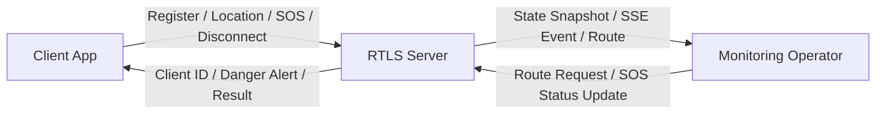

<!-- //22212023_컴퓨터공학과_김지훈 -->
<!-- 프로젝트 진행하고 있는 GitHub repository 주소: https://github.com/xweoze/real-time-monitoring-system -->

# Real Time Location System

## Conceptualization Document

---

### Disaster Vulnerable Population Real-Time Monitoring System

(재난 상황 취약계층 실시간 위치 및 상태 모니터링 시스템)

---

## [ Revision history ]

<table align="center">
<tr>
<th>Revision date</th>
<th>Version #</th>
<th>Description</th>
<th>Author</th>
</tr>

<tr align="center">
<td>2026-03-27</td>
<td>0.01</td>
<td>First Documentation</td>
<td>김지훈</td>
</tr>

<tr align="center">
<td>2026-03-28</td>
<td>0.02</td>
<td>Use case 추가 및 수정</td>
<td>김지훈</td>
</tr>

<tr align="center">
<td>2026-06-11</td>
<td>1.00</td>
<td>웹 기반 통신 구조, 자료구조 및 알고리즘 보완</td>
<td>김지훈</td>
</tr>
</table>

## = Contents =

---

### 📌 Sections

1. Business Purpose  
2. System Context Diagram  
3. Use Case List  
4. Concept of Operation  
5. Problem Statement  
6. Data Structure and Algorithm Strategy
7. Glossary
8. References

---

## 1. Business purpose

### 1.1 Project background

  

  (그림 1) 재난 상황 속 취약계층 구조 장면

---
전쟁, 자연재해, 대형 사고와 같은 재난 상황에서는  
노인, 여성, 아동과 같은 취약계층이 신속한 구조를 받지 못하는 문제가 발생한다.

특히 최근 우크라이나-러시아 전쟁, 중동 지역의 긴장(이란-미국 관계 등)과 같은 국제 정세를 통해  
실제 전쟁 상황에서 민간인과 취약계층이 겪는 위험과 구조의 어려움이 더욱 부각되고 있다.

우리나라는 현재 전쟁 상태는 아니지만, 분단 국가로서 항상 잠재적인 위기 상황에 대비해야 하는 환경에 놓여 있다.  
따라서 이러한 상황을 보며, 재난 및 전시 상황에서도 보다 빠르게 대응할 수 있는 시스템이 필요하다고 생각하게 되었다.

이러한 문제를 해결하기 위해  
취약계층의 위치와 상태를 실시간으로 수집하고,  
중앙에서 이를 모니터링할 수 있는 시스템을 만들어 관리하면 좋겠다는 생각을 하였다.

---

### 📡 System Idea

  

  (그림 3) 재난 상황 취약계층 실시간 모니터링 시스템 구조

---

이 시스템은 사용자의 위치와 상태를 서버로 전송하고,  
관제자가 이를 실시간으로 확인함으로써  
위험 상황 발생 시 빠르게 대응할 수 있도록 한다.

---

### ✔ 핵심 기능

- 사용자는 시스템에 접속하여 자신의 위치를 전송한다  
- 위험 지역에 진입하면 자동으로 위험 상태가 감지된다  
- 긴급 상황 발생 시 SOS 요청을 전송할 수 있다  
- 관제자는 모든 사용자의 위치와 상태를 실시간으로 확인한다  
- 특정 사용자의 이동 경로를 분석하여 위험도를 판단할 수 있다  

---

### 1.2 Target Market

- 재난 취약 지역 거주자  
- 노인 및 1인 가구  
- 여성 및 아동  
- 공공 안전 기관 및 구조 조직  

---

### 1.3 Goals

- 취약계층의 위치 및 상태 실시간 모니터링  
- 위험 상황 자동 감지 시스템 구축  
- 구조 요청(SOS) 기능 제공  
- 클라이언트 / 서버 / 관제 시스템 구현  
- 재난 대응 속도 향상

---
## 2. System context diagram

  

### Revised System Context

- Connect : 접속  
- Connect Notice : 접속 알림  
- Send Location & State : 위치 및 상태 전송
- Is Danger : 위험 감지  
- Send SOS : SOS 요청  
- Reception SOS : SOS 요청 확인  
- Exit : 접속 종료  
- Exit Notice : 접속 종료 알림  
- Monitoring Clients : 사용자 위치 및 상태 모니터링  
- Client Route : 사용자 이동 경로 확인  
- Danger Client : 위험 지역 체류 시 알림  
- Warning to Client : 위험 위치 알림  
- Help Client : 구조 지원 요청  
- Get Location & State : 사용자 위치 및 상태 확인

  
## 3. Use case list

### 3.1. System Connect
| Actor | Client |
|------|--------|
| Description | 사용자가 시스템에 접속하면 고유 ID를 부여받는다. |

### 3.2. Send Location & State
| Actor | Client |
|------|--------|
| Description | 사용자가 자신의 위치와 상태 정보를 시스템으로 전송한다. |

### 3.3. Danger Detection
| Actor | System |
|------|--------|
| Description | 시스템이 사용자의 위치를 기반으로 위험 지역 진입 여부를 판단한다. |

### 3.4. Danger Alert to Client
| Actor | System |
|------|--------|
| Description | 사용자가 위험 지역에 진입하면 경고 메시지를 전달한다. |

### 3.5. Send SOS
| Actor | Client |
|------|--------|
| Description | 사용자가 긴급 상황에서 구조 요청(SOS)을 전송한다. |

### 3.6. Monitoring Clients
| Actor | Monitoring Operator |
|------|---------------------|
| Description | 관제자가 사용자들의 위치와 상태를 실시간으로 확인한다. |

### 3.7. Rescue Support
| Actor | Monitoring Operator |
|------|---------------------|
| Description | 관제자가 위험 상황을 확인하고 구조를 지원한다. |

### 3.8. View Client Route
| Actor | Monitoring Operator |
|------|---------------------|
| Description | 관제자가 특정 사용자의 시간순 위치 기록과 이동 경로를 확인한다. |

### 3.9. System Exit
| Actor | Client |
|------|--------|
| Description | 사용자가 시스템 접속을 종료한다. |

  
  

## 4. Concept of operation

### 4.1. System Connect
| Purpose | 사용자가 시스템에 접속 |
|--------|----------------------|
| Approach | 사용자가 프로그램에 접속하면 서버로부터 고유 ID를 부여받고 시스템과 연결된다. |
| Dynamics | 사용자가 시스템에 처음 접속하는 경우 |
| Goals | 사용자가 시스템을 사용할 수 있도록 연결 상태를 유지한다. |

---

### 4.2. Send Location & State
| Purpose | 사용자의 위치 및 상태 정보 전송 |
|--------|------------------------------|
| Approach | 사용자는 위도(latitude), 경도(longitude), 정확도(accuracy), 상태와 측정 시각을 JSON 형식으로 서버에 전송한다. |
| Dynamics | 사용자가 이동하거나 상태 변화가 발생한 경우 |
| Goals | 시스템이 사용자 정보를 실시간으로 수집할 수 있게 한다. |

### 4.3. Danger Detection
| Purpose | 위험 지역 진입 여부 감지 |
|--------|------------------------|
| Approach | 시스템은 사용자의 위치를 기반으로 위험 지역 여부를 판단한다. |
| Dynamics | 사용자가 특정 지역으로 이동한 경우 |
| Goals | 위험 상황을 빠르게 감지한다. |

### 4.4. Danger Alert
| Purpose | 사용자에게 위험 상황 경고 |
|--------|--------------------------|
| Approach | 사용자가 위험 지역에 진입하면 시스템이 경고 메시지를 전송한다. |
| Dynamics | 사용자가 위험 지역에 진입한 경우 |
| Goals | 사용자가 위험을 인지하고 대응할 수 있도록 한다. |

### 4.5. Send SOS
| Purpose | 긴급 상황 시 구조 요청 |
|--------|----------------------|
| Approach | 사용자가 SOS 버튼을 통해 구조 요청을 보내면 시스템이 이를 관제자에게 전달한다. |
| Dynamics | 사용자가 위험 상태에 놓인 경우 |
| Goals | 빠르게 구조 요청이 전달되도록 한다. |

### 4.6. Monitoring Clients
| Purpose | 사용자 위치 및 상태 모니터링 |
|--------|----------------------------|
| Approach | 관제자는 시스템을 통해 사용자들의 위치와 상태 정보를 실시간으로 확인한다. |
| Dynamics | 여러 사용자가 동시에 시스템을 사용하는 경우 |
| Goals | 위험 상황을 신속하게 파악할 수 있도록 한다. |

### 4.7. Rescue Support
| Purpose | 구조 지원 수행 |
|--------|--------------|
| Approach | 관제자가 위험 상황을 확인하고 구조 인력에게 정보를 전달한다. |
| Dynamics | SOS 요청 또는 위험 상황 발생 시 |
| Goals | 구조 대응 시간을 최소화한다. |

### 4.8. View Client Route
| Purpose | 사용자 이동 경로 확인 |
|--------|-----------------------|
| Approach | 관제자는 특정 사용자를 선택하여 시간순 위치 기록을 지도 위 이동 경로로 확인한다. |
| Dynamics | 사용자의 이동 과정이나 위험 지역 진입 과정을 분석해야 하는 경우 |
| Goals | 구조 위치 판단과 위험 이동 패턴 분석을 지원한다. |

### 4.9. System Exit
| Purpose | 시스템 접속 종료 |
|--------|----------------|
| Approach | 사용자가 시스템 종료 시 서버와의 연결이 해제된다. |
| Dynamics | 사용자가 시스템을 종료하는 경우 |
| Goals | 시스템 자원을 효율적으로 관리한다. |

# 5. Problem statement

## 5.1. Overview
Real Time Location System은 클라이언트의 위치와 상태를 실시간으로 모니터링하는 것을 주 목적으로 한다. 또한 위험 감지 및 SOS 요청을 관제자에게 실시간으로 전달하여 위험 상황에 대응할 수 있도록 한다.

이 시스템은 다음과 같은 목표를 달성해야 한다.

- 정확한 데이터 처리  
- 실시간 데이터 처리  
- 안정적인 통신 유지  

---

## 5.2. Problem definition
Real Time Location System에서 클라이언트와 관제자가 서버를 통해 통신하는 과정에서 발생할 수 있는 주요 문제점과 해결 방안은 다음과 같다.

---

### 5.2.1. Problem#1 Protocol 설계

클라이언트와 서버, 관제 시스템 간의 정확한 데이터 통신을 위해서는 통신 규약(Protocol)을 정의하는 것이 필수적이다.

본 시스템은 웹 환경과의 호환성을 위해 HTTP와 JSON을 기반으로 프로토콜을 설계한다.

- 사용자 등록, 위치 전송, SOS 요청, 접속 종료는 HTTP API로 처리한다.
- 요청 및 응답 본문은 JSON 형식을 사용한다.
- 위치 데이터에는 위도, 경도, 정확도, 상태와 측정 시각을 포함한다.
- 서버는 HTTP 상태 코드와 오류 메시지로 처리 결과를 전달한다.

이를 통해 별도의 문자열 구분자 없이 구조화된 데이터를 검증하고 안정적으로 교환할 수 있다.

---

### 5.2.2. Problem#2 실시간 통신 처리

사용자와 서버는 지속적으로 데이터를 주고받기 때문에 실시간 처리 구조가 필요하다.

이를 해결하기 위해 멀티스레드 HTTP 서버와 SSE(Server-Sent Events)를 적용한다.

- 서버는 동시에 들어오는 HTTP 요청을 독립적인 처리 스레드에서 수행한다.
- 사용자 앱은 HTTP 요청으로 위치와 SOS 정보를 서버에 전송한다.
- 관제 화면은 SSE 연결을 유지하여 상태 변경 이벤트를 수신한다.
- SSE 연결이 끊기면 브라우저의 자동 재연결 기능을 사용한다.

이 구조를 통해 동시에 여러 사용자가 접속하더라도 지연 없이 실시간 통신이 가능하다.

---

### 5.2.3. Problem#3 클라이언트 관리

다수의 클라이언트가 접속하는 환경에서는 효율적인 사용자 관리가 필요하다.

- 서버는 `clientId`를 키로 사용하는 해시맵으로 클라이언트를 관리한다.
- 새로운 클라이언트가 접속하면 고유 ID를 생성하여 해시맵에 등록한다.
- 종료한 클라이언트는 즉시 삭제하지 않고 `OFFLINE` 상태로 변경하여 이력을 유지한다.
- 관제자는 서버의 상태 스냅샷과 실시간 이벤트를 통해 클라이언트를 모니터링한다.

이를 통해 사용자 ID 기반 조회와 상태 변경을 평균 `O(1)` 시간에 처리할 수 있다.

---

### 5.2.4. Problem#4 위험 상황 감지

클라이언트가 위험 지역에 진입하거나 특정 조건을 만족할 경우 위험 상황을 감지해야 한다.

- 클라이언트의 최신 위치와 각 위험 지역 중심 사이의 거리를 계산한다.
- 계산된 거리가 위험 지역 반경 이내이면 즉시 위험 상태로 판단한다.
- 여러 위험 지역이 겹치면 심각도가 가장 높은 지역을 선택한다.
- 위험 상태가 변경되면 클라이언트와 관제자에게 알림을 전달한다.

향후에는 경계 부근에서 상태가 반복 변경되는 현상을 줄이기 위해 체류 시간 또는 히스테리시스 조건을 추가할 수 있다.

이를 통해 사고 예방 및 빠른 대응이 가능하다.

---

### 5.2.5. Problem#5 SOS 요청 처리

클라이언트가 긴급 상황에서 도움을 요청할 수 있어야 한다.

- 클라이언트는 SOS 신호를 서버로 전송한다.  
- 서버는 해당 정보를 관제 시스템에 전달한다.
- SOS 요청에는 위치 및 상태 정보가 포함된다.  
- SOS 상태는 `OPEN`, `ACKNOWLEDGED`, `RESOLVED`, `CANCELLED`로 관리한다.

이를 통해 긴급 상황에서 빠른 구조 요청이 가능하다.

---

### 5.2.6. Problem#6 위치 및 상태 동기화

클라이언트의 위치와 상태 정보는 항상 최신 상태로 유지되어야 한다.

- 클라이언트는 일정 주기로 위치 데이터를 서버에 전송한다.  
- 서버는 해당 정보를 관제자에게 실시간으로 전달한다.
- 데이터 지연 및 손실을 최소화하는 구조를 유지한다.  

이를 통해 정확한 모니터링이 가능하다.

---

# 6. Data Structure and Algorithm Strategy

## 6.1. Data Structures

| Data | Data Structure | Selection Reason |
|---|---|---|
| Client Registry | Hash Map (`clientId → Client`) | 사용자 등록, 조회, 상태 변경을 평균 `O(1)`에 처리 |
| Route History | Hash Map + Bounded List | 사용자별 위치를 시간순으로 저장하고 최대 개수를 제한 |
| Danger Areas | List | 현재 위험 지역 수가 적어 순차 비교가 단순하고 충분히 빠름 |
| SOS Events | Hash Map | 이벤트 ID로 구조 접수 및 완료 상태를 빠르게 갱신 |
| Event Timeline | Bounded List | 최신 이벤트를 앞에 추가하고 오래된 이벤트를 제거 |
| SSE Subscribers | Queue List | 관제 화면별 이벤트를 독립적으로 전달하고 느린 연결을 분리 |

위치 기록과 이벤트 기록은 메모리 증가를 방지하기 위해 최대 저장 개수를 제한한다. 시스템 규모가 커질 경우 위치 이력은 데이터베이스와 공간 인덱스로 이전한다.

## 6.2. Algorithms

| Function | Algorithm | Description |
|---|---|---|
| Danger Detection | Haversine Formula | 두 위도·경도 사이의 구면 거리를 미터 단위로 계산 |
| Circular Area Check | Distance ≤ Radius | 사용자와 위험 지역 중심의 거리가 반경 이내인지 판정 |
| Overlapping Area Selection | Maximum Severity Selection | 겹치는 위험 지역 중 심각도가 가장 높은 지역 선택 |
| Route Construction | Time-ordered Accumulation | 위치 데이터를 측정 시각 순서로 연결하여 이동 경로 생성 |
| SOS Processing | State Machine | `OPEN → ACKNOWLEDGED → RESOLVED` 또는 `CANCELLED` 상태로 구조 진행 관리 |
| Real-time Notification | Publish-Subscribe | 상태 변경을 구독 중인 관제 화면에 전파 |

위험 지역이 대규모로 증가하면 모든 지역을 순차 비교하는 대신 R-tree, Quadtree 또는 Geohash 기반 공간 인덱스를 적용하여 후보 지역을 먼저 줄일 수 있다.

# 7. Glossary

| Term | Description |
|------|-------------|
| Real Time Location System | 사용자의 위치와 상태를 실시간으로 수집하고 관제하는 시스템 |
| 클라이언트 | 위치와 상태를 서버에 전송하는 사용자 또는 사용자 앱 |
| 관제자 | 사용자 위치, 위험 상태 및 SOS 요청을 확인하고 구조를 지원하는 운영자 |
| 모니터링 | 클라이언트들의 위치 및 상태를 지속적으로 감시, 관찰하는 행위 |
| Thread | 서버가 여러 요청을 동시에 처리하기 위한 프로그램 실행 흐름 |
| HTTP API | 클라이언트와 서버가 요청과 응답을 교환하는 인터페이스 |
| JSON | 위치, 상태 및 SOS 데이터를 표현하는 구조화된 데이터 형식 |
| SSE | 서버가 관제 화면에 상태 변경 이벤트를 지속적으로 전달하는 방식 |
| Location Data | 위도, 경도, 정확도 및 측정 시각으로 구성된 위치 정보 |
| Danger Area | 중심 좌표, 반경과 심각도로 정의되는 위험 지역 |
| SOS | 사용자가 관제자에게 보내는 긴급 구조 요청 |

# 8. References

- 본 보고서의 모든 그림은 직접 제작함 (Created by author)
- GitHub Repository : https://github.com/xweoze/real-time-monitoring-system
- Python HTTP Server Documentation
- MDN Web Docs - Server-Sent Events
- JSON Data Interchange Format
