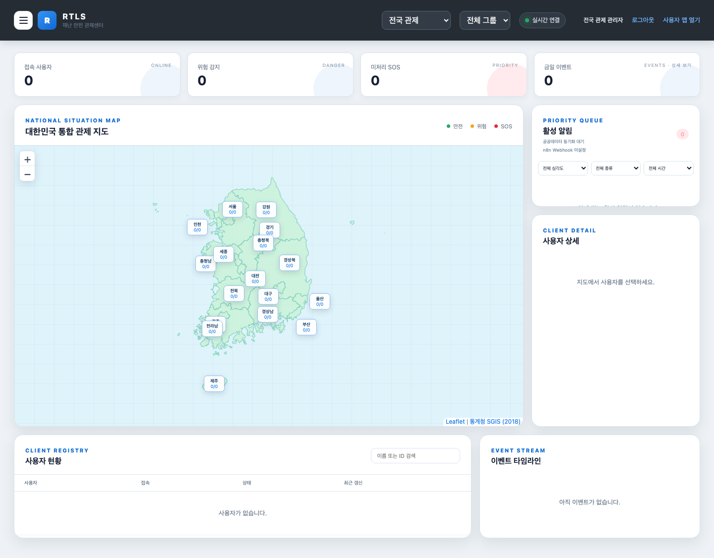
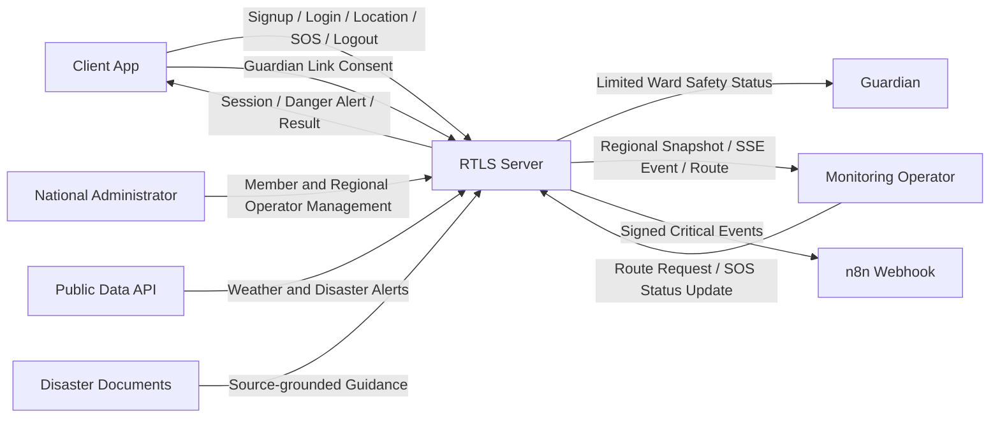

<!-- //22212023_컴퓨터공학과_김지훈 -->
<!-- 프로젝트 진행하고 있는 GitHub repository 주소: https://github.com/xweoze/real-time-monitoring-system -->

# Real Time Location System

## Conceptualization Document

---

### Disaster Vulnerable Population Real-Time Monitoring System

(재난 상황 취약계층 실시간 위치 및 상태 모니터링 시스템)

---

## [ Revision history ]

<table align="center">
<tr>
<th>Revision date</th>
<th>Version #</th>
<th>Description</th>
<th>Author</th>
</tr>

<tr align="center">
<td>2026-03-27</td>
<td>0.01</td>
<td>First Documentation</td>
<td>김지훈</td>
</tr>

<tr align="center">
<td>2026-03-28</td>
<td>0.02</td>
<td>Use case 추가 및 수정</td>
<td>김지훈</td>
</tr>

<tr align="center">
<td>2026-06-11</td>
<td>1.00</td>
<td>웹 기반 통신 구조, 자료구조 및 알고리즘 보완</td>
<td>김지훈</td>
</tr>

<tr align="center">
<td>2026-06-11</td>
<td>1.10</td>
<td>이해관계자, 개인정보 및 운영 범위 보완</td>
<td>김지훈</td>
</tr>
<tr align="center">
<td>2026-06-13</td>
<td>1.20</td>
<td>계정·지역 권한·회원 관리·공공데이터 기능 반영</td>
<td>김지훈</td>
</tr>
<tr align="center">
<td>2026-06-14</td>
<td>1.30</td>
<td>안전 분석·외부 알림·재난문서 검색과 현재 UI 반영</td>
<td>김지훈</td>
</tr>
</table>

## = Contents =

---

### 📌 Sections

1. Business Purpose  
2. System Context Diagram  
3. Use Case List  
4. Concept of Operation  
5. Problem Statement  
6. Data Structure and Algorithm Strategy
7. Benchmark and Differentiation
8. Glossary
9. References

---

## 1. Business purpose

### 1.1 Project background

  

  (그림 1) 문제 배경을 설명하기 위한 재난 구조 개념 이미지이며 실제 시스템 화면이나 사건 기록이 아니다.

---
전쟁, 자연재해, 대형 사고와 같은 재난 상황에서는  
노인, 여성, 아동과 같은 취약계층이 신속한 구조를 받지 못하는 문제가 발생한다.

특히 최근 우크라이나-러시아 전쟁, 중동 지역의 긴장(이란-미국 관계 등)과 같은 국제 정세를 통해  
실제 전쟁 상황에서 민간인과 취약계층이 겪는 위험과 구조의 어려움이 더욱 부각되고 있다.

우리나라는 현재 전쟁 상태는 아니지만, 분단 국가로서 항상 잠재적인 위기 상황에 대비해야 하는 환경에 놓여 있다.  
따라서 이러한 상황을 보며, 재난 및 전시 상황에서도 보다 빠르게 대응할 수 있는 시스템이 필요하다고 생각하게 되었다.

이러한 문제를 해결하기 위해  
취약계층의 위치와 상태를 실시간으로 수집하고,  
중앙에서 이를 모니터링할 수 있는 시스템을 만들어 관리하면 좋겠다는 생각을 하였다.

---

### 📡 System Idea

  

  (그림 2) Playwright 화면 회귀검사로 검증하는 현재 전국 관제 대시보드

---

이 시스템은 사용자의 위치와 상태를 서버로 전송하고,  
관제자가 이를 실시간으로 확인함으로써  
위험 상황 발생 시 빠르게 대응할 수 있도록 한다.

---

### ✔ 핵심 기능

- 사용자는 시스템에 접속하여 자신의 위치를 전송한다  
- 위험 지역에 진입하면 자동으로 위험 상태가 감지된다  
- 긴급 상황 발생 시 SOS 요청을 전송할 수 있다  
- 관제자는 모든 사용자의 위치와 상태를 실시간으로 확인한다  
- 특정 사용자의 이동 경로를 분석하여 위험도를 판단할 수 있다  
- 사용자는 회원가입과 로그인을 통해 자신의 단말만 연결한다
- 전국 관리자는 지역 관리자와 전체 회원을 관리한다
- 지역 관리자는 담당 지역 회원과 이벤트만 확인한다
- 공공데이터의 지역별 재난·기상 알림을 관제 화면에서 확인한다
- 원형·다각형 위험구역의 진입과 이탈을 기록한다
- 신호 끊김·배터리 부족·장시간 무동작을 기기 경고로 표시한다
- 이동 거리·정차 시간·자주 방문한 장소와 가까운 안전시설을 확인한다
- 사용자 그룹, 알림 검색과 관리자 작업 감사 로그를 관리한다
- 선택적으로 n8n Webhook으로 중요 이벤트를 외부 자동화에 전달한다
- 출처가 표시된 재난 행동요령 문서를 검색한다

---

### 1.2 Target Market

- 재난 취약 지역 거주자  
- 노인 및 1인 가구  
- 여성 및 아동  
- 공공 안전 기관 및 구조 조직  

---

### 1.3 Goals

- 취약계층의 위치 및 상태 실시간 모니터링  
- 위험 상황 자동 감지 시스템 구축  
- 구조 요청(SOS) 기능 제공  
- 클라이언트 / 서버 / 관제 시스템 구현  
- 재난 대응 속도 향상

### 1.4 Stakeholders

| Stakeholder | Interest and Responsibility |
|---|---|
| Client User | 위치 공유 여부를 선택하고 위험 경고 및 SOS 기능을 사용 |
| Guardian | 사용자 동의를 전제로 안전 상태와 대응 결과를 확인 |
| Monitoring Operator | 위험 및 SOS 이벤트를 확인하고 구조 지원 절차 수행 |
| Regional Operator | 담당 지역의 회원, 위험, SOS와 공공 알림을 관제 |
| National Administrator | 전체 회원 정보와 지역 관리자 계정을 관리 |
| System Administrator | 서버, 계정, 보안, 데이터 보존과 장애 복구 관리 |
| Rescue Organization | 운영 기관과 사전 협의된 경우에만 구조 정보를 전달받음 |

### 1.5 Assumptions and Constraints

- 현재 구현은 교육 및 시연 목적의 로컬 MVP이다.
- SOS 요청은 관제 대시보드에 전달되며 실제 119 신고를 자동 수행하지 않는다.
- 사용자는 위치 수집 목적과 보존 범위를 안내받고 위치 공유에 동의해야 한다.
- 사용자는 언제든 위치 공유를 종료할 수 있어야 한다.
- 서버 상태는 SQLite에 저장되어 재시작 후 복구되며, 복구된 사용자는 안전하게 `OFFLINE` 상태로 시작한다.
- 사용자 계정, 비밀번호 해시와 로그인 세션은 SQLite에 저장한다.
- 계정이 없거나 삭제된 사용자와 연결된 과거 단말 데이터는 자동 정리한다.
- 현재 지도는 Leaflet과 통계청 SGIS의 2018년 시·도 경계를 사용한다. 실제
  위·경도 배치와 관제자 요청 기반 주소 변환을 지원하지만 최신 행정 경계,
  도로·건물 배경 지도와 주소 검색은 제공하지 않는다.
- 공공데이터는 기관의 활용 승인, 실제 호출 URL과 인증키가 설정된 경우에만 동기화한다.
- 다수 사용자 처리 성능은 부하 테스트 전까지 목표값으로만 관리한다.

---
## 2. System context diagram

  

  (그림 3) 초기 컨텍스트 개념도. 아래 Revised System Context가 현재 구현 범위의 기준이다.

### Revised System Context

- Connect : 접속  
- Connect Notice : 접속 알림  
- Send Location & State : 위치 및 상태 전송
- Is Danger : 위험 감지  
- Send SOS : SOS 요청  
- Reception SOS : SOS 요청 확인  
- Exit : 접속 종료  
- Exit Notice : 접속 종료 알림  
- Monitoring Clients : 사용자 위치 및 상태 모니터링  
- Client Route : 사용자 이동 경로 확인  
- Danger Client : 위험 지역 체류 시 알림  
- Warning to Client : 위험 위치 알림  
- Help Client : 구조 지원 요청  
- Get Location & State : 사용자 위치 및 상태 확인

  
## 3. Use case list

### 3.1. System Connect
| Actor | Client |
|------|--------|
| Description | 사용자가 회원가입 또는 로그인 후 계정과 연결된 관제 단말로 접속한다. |

### 3.2. Send Location & State
| Actor | Client |
|------|--------|
| Description | 사용자가 자신의 위치와 상태 정보를 시스템으로 전송한다. |

### 3.3. Danger Detection
| Actor | System |
|------|--------|
| Description | 시스템이 사용자의 위치를 기반으로 위험 지역 진입 여부를 판단한다. |

### 3.4. Danger Alert to Client
| Actor | System |
|------|--------|
| Description | 사용자가 위험 지역에 진입하면 경고 메시지를 전달한다. |

### 3.5. Send SOS
| Actor | Client |
|------|--------|
| Description | 사용자가 긴급 상황에서 구조 요청(SOS)을 전송한다. |

### 3.6. Monitoring Clients
| Actor | Monitoring Operator |
|------|---------------------|
| Description | 관제자가 사용자들의 위치와 상태를 실시간으로 확인한다. |

### 3.7. Rescue Support
| Actor | Monitoring Operator |
|------|---------------------|
| Description | 관제자가 위험 상황을 확인하고 구조를 지원한다. |

### 3.8. View Client Route
| Actor | Monitoring Operator |
|------|---------------------|
| Description | 관제자가 특정 사용자의 시간순 위치 기록과 이동 경로를 확인한다. |

### 3.9. System Exit
| Actor | Client |
|------|--------|
| Description | 사용자가 위치 공유 연결을 종료하거나 계정에서 로그아웃한다. |

### 3.10. Account Management
| Actor | Client User / Guardian |
|------|--------|
| Description | 일반 사용자와 보호자는 회원가입·로그인·로그아웃과 서버 세션 종료를 수행한다. |

### 3.11. Member Management
| Actor | National Administrator / Regional Operator |
|------|--------|
| Description | 관리자는 권한 범위 안에서 회원 정보를 조회·수정·삭제하고 연결된 관제 데이터를 정리한다. |

### 3.12. Regional Monitoring
| Actor | National Administrator / Regional Operator |
|------|--------|
| Description | 전국 관리자는 17개 시·도를 통합 관제하고, 지역 관리자는 담당 지역 데이터만 조회한다. |

### 3.13. Public Alert Monitoring
| Actor | Monitoring Operator / External Public Data API |
|------|--------|
| Description | 기관별 재난·기상 응답을 내부 표준 알림으로 변환하여 지역별 활성 알림에 표시한다. |

### 3.14. Danger Area and Device Alert Management
| Actor | Monitoring Operator / System |
|------|--------|
| Description | 원형·다각형 위험구역을 관리하고 진입·이탈, 신호 끊김, 배터리 부족과 장시간 무동작을 감지한다. |

### 3.15. Movement Analytics and Safety Facilities
| Actor | Monitoring Operator |
|------|--------|
| Description | 이동 거리, 정차 시간, 자주 방문한 장소와 가까운 대피소·병원·소방서를 조회한다. |

### 3.16. Group, Alert and Audit Management
| Actor | National Administrator / Regional Operator |
|------|--------|
| Description | 사용자 그룹과 지도 필터, 알림 조건 검색, 권한 범위의 관리자 작업 기록을 관리한다. |

### 3.17. Guardian Safety Check
| Actor | Client User / Guardian |
|------|--------|
| Description | 사용자가 보호자를 직접 연결하고 보호자는 허용된 대상의 최신 안전 상태만 확인한다. |

### 3.18. External Alert Automation
| Actor | System / n8n |
|------|--------|
| Description | 중요 이벤트를 비동기 HMAC 서명 Webhook으로 선택 전송한다. |

### 3.19. Disaster Knowledge Search
| Actor | Monitoring Operator |
|------|--------|
| Description | 로컬 재난 행동요령에서 질문과 관련된 문단을 검색하고 공식 출처와 함께 표시한다. |

  
  

## 4. Concept of operation

### 4.1. System Connect
| Purpose | 사용자가 시스템에 접속 |
|--------|----------------------|
| Approach | 사용자가 회원가입 또는 로그인으로 12시간 세션을 발급받고 서비스 연결을 실행하면 계정 ID와 관제 단말 ID가 연결된다. |
| Dynamics | 사용자가 안전 서비스를 시작하는 경우 |
| Goals | 사용자가 시스템을 사용할 수 있도록 연결 상태를 유지한다. |

---

### 4.2. Send Location & State
| Purpose | 사용자의 위치 및 상태 정보 전송 |
|--------|------------------------------|
| Approach | 사용자는 위도(latitude), 경도(longitude), 정확도(accuracy), 상태와 측정 시각을 JSON 형식으로 서버에 전송한다. |
| Dynamics | 사용자가 이동하거나 상태 변화가 발생한 경우 |
| Goals | 시스템이 사용자 정보를 실시간으로 수집할 수 있게 한다. |

### 4.3. Danger Detection
| Purpose | 위험 지역 진입 여부 감지 |
|--------|------------------------|
| Approach | 시스템은 사용자의 위치를 기반으로 위험 지역 여부를 판단한다. |
| Dynamics | 사용자가 특정 지역으로 이동한 경우 |
| Goals | 위험 상황을 빠르게 감지한다. |

### 4.4. Danger Alert
| Purpose | 사용자에게 위험 상황 경고 |
|--------|--------------------------|
| Approach | 사용자가 위험 지역에 진입하면 시스템이 경고 메시지를 전송한다. |
| Dynamics | 사용자가 위험 지역에 진입한 경우 |
| Goals | 사용자가 위험을 인지하고 대응할 수 있도록 한다. |

### 4.5. Send SOS
| Purpose | 긴급 상황 시 구조 요청 |
|--------|----------------------|
| Approach | 사용자가 SOS 버튼을 통해 구조 요청을 보내면 시스템이 이를 관제자에게 전달한다. |
| Dynamics | 사용자가 위험 상태에 놓인 경우 |
| Goals | 빠르게 구조 요청이 전달되도록 한다. |

### 4.6. Monitoring Clients
| Purpose | 사용자 위치 및 상태 모니터링 |
|--------|----------------------------|
| Approach | 관제자는 시스템을 통해 사용자들의 위치와 상태 정보를 실시간으로 확인한다. |
| Dynamics | 여러 사용자가 동시에 시스템을 사용하는 경우 |
| Goals | 위험 상황을 신속하게 파악할 수 있도록 한다. |

### 4.7. Rescue Support
| Purpose | 구조 지원 수행 |
|--------|--------------|
| Approach | 관제자가 위험 상황을 확인하고 구조 인력에게 정보를 전달한다. |
| Dynamics | SOS 요청 또는 위험 상황 발생 시 |
| Goals | 구조 대응 시간을 최소화한다. |

### 4.8. View Client Route
| Purpose | 사용자 이동 경로 확인 |
|--------|-----------------------|
| Approach | 관제자는 특정 사용자를 선택하여 시간순 위치 기록을 지도 위 이동 경로로 확인한다. |
| Dynamics | 사용자의 이동 과정이나 위험 지역 진입 과정을 분석해야 하는 경우 |
| Goals | 구조 위치 판단과 위험 이동 패턴 분석을 지원한다. |

### 4.9. System Exit
| Purpose | 시스템 접속 종료 |
|--------|----------------|
| Approach | 사용자가 시스템 종료 시 서버와의 연결이 해제된다. |
| Dynamics | 사용자가 시스템을 종료하는 경우 |
| Goals | 시스템 자원을 효율적으로 관리한다. |

### 4.10. Extended Monitoring Operations
| Purpose | 계정·회원·위험구역·안전 분석과 외부 정보 연계 |
|--------|----------------|
| Approach | 역할별 권한으로 회원·보호자·지역·그룹을 관리하고, 위험구역·기기 경고·이동 통계·안전시설·공공 알림·재난문서 검색 결과를 관제 화면에 통합한다. 선택적으로 중요 이벤트를 n8n Webhook으로 전달한다. |
| Dynamics | 관리 작업, 위험 또는 기기 이벤트, 공공 알림 수신, 관제자의 안전 정보 검색이 발생한 경우 |
| Goals | 단순 위치 표시를 넘어 실제 관제 의사결정에 필요한 정보와 이력을 한 화면에서 제공한다. |

# 5. Problem statement

## 5.1. Overview
Real Time Location System은 클라이언트의 위치와 상태를 실시간으로 모니터링하는 것을 주 목적으로 한다. 또한 위험 감지 및 SOS 요청을 관제자에게 실시간으로 전달하여 위험 상황에 대응할 수 있도록 한다.

이 시스템은 다음과 같은 목표를 달성해야 한다.

- 정확한 데이터 처리  
- 실시간 데이터 처리  
- 안정적인 통신 유지  

---

## 5.2. Problem definition
Real Time Location System에서 클라이언트와 관제자가 서버를 통해 통신하는 과정에서 발생할 수 있는 주요 문제점과 해결 방안은 다음과 같다.

---

### 5.2.1. Problem#1 Protocol 설계

클라이언트와 서버, 관제 시스템 간의 정확한 데이터 통신을 위해서는 통신 규약(Protocol)을 정의하는 것이 필수적이다.

본 시스템은 웹 환경과의 호환성을 위해 HTTP와 JSON을 기반으로 프로토콜을 설계한다.

- 회원가입·로그인·사용자 단말 연결, 위치 전송, SOS 요청과 접속 종료는 HTTP API로 처리한다.
- 요청 및 응답 본문은 JSON 형식을 사용한다.
- 위치 데이터에는 위도, 경도, 정확도, 상태와 측정 시각을 포함한다.
- 서버는 HTTP 상태 코드와 오류 메시지로 처리 결과를 전달한다.

이를 통해 별도의 문자열 구분자 없이 구조화된 데이터를 검증하고 안정적으로 교환할 수 있다.

---

### 5.2.2. Problem#2 실시간 통신 처리

사용자 앱의 위치·SOS 요청과 관제 화면의 상태 갱신을 빠르게 처리하기 위해 실시간 처리 구조가 필요하다.

이를 해결하기 위해 멀티스레드 HTTP 서버와 SSE(Server-Sent Events)를 적용한다.

- 서버는 동시에 들어오는 HTTP 요청을 독립적인 처리 스레드에서 수행한다.
- 사용자 앱은 HTTP 요청으로 위치와 SOS 정보를 서버에 전송한다.
- 관제 화면은 SSE 연결을 유지하여 상태 변경 이벤트를 수신한다.
- SSE 연결이 끊기면 브라우저의 자동 재연결 기능을 사용한다.

이 구조를 통해 동시에 여러 사용자가 접속하더라도 지연 없이 실시간 통신이 가능하다.

---

### 5.2.3. Problem#3 클라이언트 관리

다수의 클라이언트가 접속하는 환경에서는 효율적인 사용자 관리가 필요하다.

- 서버는 `clientId`를 키로 사용하는 해시맵으로 클라이언트를 관리한다.
- 인증된 회원이 처음 연결하면 단말 ID를 생성해 해시맵에 등록하고 `userId` 인덱스에 연결한다.
- 종료한 클라이언트는 즉시 삭제하지 않고 `OFFLINE` 상태로 변경하여 이력을 유지한다.
- 관제자는 서버의 상태 스냅샷과 실시간 이벤트를 통해 클라이언트를 모니터링한다.

이를 통해 사용자 ID 기반 조회와 상태 변경을 평균 `O(1)` 시간에 처리할 수 있다.

---

### 5.2.4. Problem#4 위험 상황 감지

클라이언트가 위험 지역에 진입하거나 특정 조건을 만족할 경우 위험 상황을 감지해야 한다.

- 클라이언트의 최신 위치와 각 위험 지역 중심 사이의 거리를 계산한다.
- 계산된 거리가 위험 지역 반경 이내이면 즉시 위험 상태로 판단한다.
- 여러 위험 지역이 겹치면 심각도가 가장 높은 지역을 선택한다.
- 위험 상태가 변경되면 클라이언트와 관제자에게 알림을 전달한다.

향후에는 경계 부근에서 상태가 반복 변경되는 현상을 줄이기 위해 체류 시간 또는 히스테리시스 조건을 추가할 수 있다.

이를 통해 사고 예방 및 빠른 대응이 가능하다.

---

### 5.2.5. Problem#5 SOS 요청 처리

클라이언트가 긴급 상황에서 도움을 요청할 수 있어야 한다.

- 클라이언트는 SOS 신호를 서버로 전송한다.  
- 서버는 해당 정보를 관제 시스템에 전달한다.
- SOS 요청에는 위치 및 상태 정보가 포함된다.  
- SOS 상태는 `OPEN`, `ACKNOWLEDGED`, `DISPATCHED`, `RESOLVED`,
  `CANCELLED`로 관리한다.
- 관제 담당자, 처리 메모와 단계별 변경 시각을 이력으로 저장한다.

이를 통해 긴급 상황에서 빠른 구조 요청이 가능하다.

---

### 5.2.6. Problem#6 위치 및 상태 동기화

클라이언트의 위치와 상태 정보는 항상 최신 상태로 유지되어야 한다.

- 현재 MVP에서 클라이언트는 사용자의 위치 전송 동작 또는 위치 조회 성공 시 데이터를 서버에 전송한다.
- 사용자가 자동 위치 공유를 선택하면 브라우저 위치 변경을 감지하여 서버로 전송한다.
- 서버는 해당 정보를 관제자에게 실시간으로 전달한다.
- 관제자는 필요할 때 최신 좌표를 주소로 변환해 확인할 수 있다.
- 데이터 지연 및 손실을 최소화하는 구조를 유지한다.  

이를 통해 정확한 모니터링이 가능하다.

---

### 5.2.7. Problem#7 개인정보 및 접근 통제

위치 정보는 개인의 이동과 생활 패턴을 나타내는 민감정보이므로 기능 구현만으로 충분하지 않다.

- 위치 수집 목적과 보존 기간을 사용자에게 안내한다.
- 사용자의 명시적 동의를 받고 언제든 공유를 중단할 수 있게 한다.
- 관제자는 인증과 권한 확인 후 필요한 사용자 정보만 조회한다.
- 보호자는 보호 대상 사용자가 직접 계정을 연결한 경우에만 최신 안전 상태와 위치를 조회한다.
- 위치 조회와 SOS 처리 이력을 감사 로그로 남긴다.
- 보존 기간이 끝난 위치 정보는 복구할 수 없도록 파기한다.

현재 MVP에는 PBKDF2 비밀번호 해싱, 12시간 Bearer 세션, 전국·지역·사용자·보호자
역할 검사, 사용자 동의 기반 보호자 연결과 회원 삭제 기능이 구현되어 있다. 다만
HTTPS, HttpOnly 쿠키, MFA, 영구 감사 로그, 법적 보존 기간에 따른 자동 파기와
백업 정책은 실제 배포 전에 추가해야 한다.

---

### 5.2.8. Problem#8 운영 장애와 구조기관 연계

재난 상황에서는 서버 장애, 네트워크 단절 또는 위치 오차가 발생할 수 있다.

- 서버 장애 시 데이터를 복구할 수 있는 영구 저장소와 백업이 필요하다.
- 오래된 위치와 최신 위치를 명확히 구분하여 잘못된 구조 판단을 방지한다.
- 위치 정확도와 마지막 갱신 시간을 관제 화면에 표시한다.
- 실제 구조기관 연계 시 전달 성공 여부와 실패 시 대체 연락 절차를 정의한다.
- 시스템 경고는 구조기관의 공식 판단을 대신하지 않는다는 운영 원칙을 둔다.

---

# 6. Data Structure and Algorithm Strategy

## 6.1. Data Structures

| Data | Data Structure | Selection Reason |
|---|---|---|
| Client Registry | Hash Map (`clientId → Client`) | 사용자 등록, 조회, 상태 변경을 평균 `O(1)`에 처리 |
| User Accounts | SQLite Table (`users`) | 계정, 역할, 지역과 선택형 프로필을 영구 저장 |
| Login Sessions | SQLite Table (`sessions`) | 해시된 Bearer 토큰과 12시간 만료 시각 관리 |
| Guardian Links | SQLite Junction Table (`guardian_links`) | 보호자와 보호 대상의 다대다 연결, 중복 방지와 계정 삭제 시 연쇄 정리 |
| User Index | Hash Map (`userId → clientId`) | 로그인 계정과 관제 단말을 평균 `O(1)`에 연결 |
| Region Index | Hash Map (`regionId → Set[clientId]`) | 지역별 사용자 조회와 집계를 전체 순회 없이 수행 |
| Route History | Hash Map + Bounded List | 사용자별 위치를 시간순으로 저장하고 최대 개수를 제한 |
| Danger Areas | List | 현재 위험 지역 수가 적어 순차 비교가 단순하고 충분히 빠름 |
| Polygon Danger Areas | Vertex List | Ray Casting으로 비정형 구역 내부 여부 판정 |
| Client Groups | Hash Map + Member List | 그룹별 사용자 일괄 관리와 지도 필터 |
| Audit Logs | Bounded List | 최근 관리자 작업 500건을 시간 역순으로 보존 |
| Notification Queue | Bounded Queue | n8n 장애가 실시간 위치·SOS 처리에 전파되지 않도록 비동기 분리 |
| Disaster Knowledge | Markdown Sections + Token Index | 공식 행동요령 문단을 출처와 함께 검색하고 생성형 환각 방지 |
| SOS Events | Hash Map | 이벤트 ID로 구조 접수 및 완료 상태를 빠르게 갱신 |
| Event Timeline | Bounded List | 최신 이벤트를 앞에 추가하고 오래된 이벤트를 제거 |
| SSE Subscribers | Queue List | 관제 화면별 이벤트를 독립적으로 전달하고 느린 연결을 분리 |
| Public Alerts | Hash Map (`source:id → alert`) | 기관 알림 중복을 갱신하고 지역·만료 기준으로 조회 |

위치 기록과 이벤트 기록은 메모리 증가를 방지하기 위해 최대 저장 개수를 제한한다. 시스템 규모가 커질 경우 위치 이력은 데이터베이스와 공간 인덱스로 이전한다.

현재 MVP는 전체 상태 스냅샷을 SQLite에 저장해 로컬 재시작 복구를 지원한다. 운영 환경에서는 사용자, 위치, SOS와 감사 로그를 각각 정규화하여 저장해야 한다.

## 6.2. Algorithms

| Function | Algorithm | Description |
|---|---|---|
| Danger Detection | Haversine Formula | 두 위도·경도 사이의 구면 거리를 미터 단위로 계산 |
| Circular Area Check | Distance ≤ Radius | 사용자와 위험 지역 중심의 거리가 반경 이내인지 판정 |
| Overlapping Area Selection | Maximum Severity Selection | 겹치는 위험 지역 중 심각도가 가장 높은 지역 선택 |
| Route Construction | Time-ordered Accumulation | 위치 데이터를 측정 시각 순서로 연결하여 이동 경로 생성 |
| SOS Processing | State Machine | `OPEN → ACKNOWLEDGED → DISPATCHED → RESOLVED` 또는 `CANCELLED` 상태로 구조 진행 관리 |
| Real-time Notification | Publish-Subscribe | 상태 변경을 구독 중인 관제 화면에 전파 |
| Regional Filtering | Indexed Set Lookup | 역할과 지역 ID를 기준으로 조회 범위를 제한 |
| Public Data Normalization | Adapter / Mapping | 기관별 JSON·XML·텍스트 응답을 공통 알림 구조로 변환 |
| Orphan Client Cleanup | Set Membership Filtering | 실제 회원 ID 집합에 없는 단말과 관련 데이터를 시작 시 제거 |
| Polygon Area Check | Ray Casting | 다각형 꼭짓점을 기준으로 사용자 위치의 내부 포함 여부 판정 |
| Movement Analytics | Bounded Route Scan | 최근 경로를 한 번 순회해 거리·정차·방문 빈도 계산 |
| Webhook Delivery | Bounded Queue + Worker | 외부 자동화 지연을 위치·SOS 요청 처리와 분리 |
| Disaster Retrieval | Tokenization + IDF Scoring | 질문과 관련된 문단을 순위화하고 출처와 함께 반환 |

위험 지역이 대규모로 증가하면 모든 지역을 순차 비교하는 대신 R-tree, Quadtree 또는 Geohash 기반 공간 인덱스를 적용하여 후보 지역을 먼저 줄일 수 있다.

# 7. Benchmark and Differentiation

| System | Strong Points | Implication for This Project |
|---|---|---|
| Traccar | 실제 지도, 다양한 GPS 장치, 지오펜스, 경로와 보고서 | 실제 지도와 장치 연동, 경로 보고서 기능을 향후 확장 |
| Life360 | 쉬운 모바일 UX, 장소 알림, 위치 이력, 충돌 감지와 긴급 지원 | 사용자 동의, 위치 공유 제어와 모바일 알림 경험 보완 |
| RapidSOS | 공공 긴급대응 기관 연계, GIS, 현장 데이터와 사고 검증 | 구조기관 연계는 API뿐 아니라 기관 협약과 검증 절차가 필요 |
| Sahana Eden | 기관, 인력, 대피소, 물자와 지도를 통합한 재난 운영 | 장기적으로 사용자 위치를 넘어 재난 자원 관리와 연계 가능 |

본 프로젝트는 상용 서비스와 달리 **재난 취약계층의 계정 기반 위치 공유, 지역별
관제, 위험 지역 진입 감지, SOS 처리와 공공 알림 확인 흐름을 하나의 학습용 MVP로
구현**한다는 데 의미가 있다. 인증과 로컬 SQLite 저장, 시·도 경계 지도는 제공하지만 도로·주소 지도,
모바일 백그라운드 동작, 공공 구조기관 자동 연계, 운영급 보안과 검증된 대규모
성능은 아직 제공하지 않는다.

# 8. Glossary

| Term | Description |
|------|-------------|
| Real Time Location System | 사용자의 위치와 상태를 실시간으로 수집하고 관제하는 시스템 |
| 클라이언트 | 위치와 상태를 서버에 전송하는 사용자 또는 사용자 앱 |
| 관제자 | 사용자 위치, 위험 상태 및 SOS 요청을 확인하고 구조를 지원하는 운영자 |
| 모니터링 | 클라이언트들의 위치 및 상태를 지속적으로 감시, 관찰하는 행위 |
| Thread | 서버가 여러 요청을 동시에 처리하기 위한 프로그램 실행 흐름 |
| HTTP API | 클라이언트와 서버가 요청과 응답을 교환하는 인터페이스 |
| JSON | 위치, 상태 및 SOS 데이터를 표현하는 구조화된 데이터 형식 |
| SSE | 서버가 관제 화면에 상태 변경 이벤트를 지속적으로 전달하는 방식 |
| Location Data | 위도, 경도, 정확도 및 측정 시각으로 구성된 위치 정보 |
| Danger Area | 중심·반경의 원형 또는 꼭짓점 목록의 다각형으로 정의되는 위험 지역 |
| SOS | 사용자가 관제자에게 보내는 긴급 구조 요청 |

# 9. References

- 본 보고서의 모든 그림은 직접 제작함 (Created by author)
- GitHub Repository : https://github.com/xweoze/real-time-monitoring-system
- Python HTTP Server Documentation
- MDN Web Docs - Server-Sent Events
- JSON Data Interchange Format
- Traccar Official Website: https://www.traccar.org/
- Life360 Official Website: https://www.life360.com/
- RapidSOS Official Website: https://rapidsos.com/
- Sahana Eden Official Website: https://sahanafoundation.org/products/eden/
