<!-- 22212023 컴퓨터공학과 김지훈 -->
<!-- GitHub Repository: https://github.com/xweoze/real-time-monitoring-system -->

# Real Time Location System

## Design Document

---

### Disaster Vulnerable Population Real-Time Monitoring System

재난 상황 취약계층 실시간 위치 및 상태 모니터링 시스템

---

## [ Revision history ]

<table align="center">
  <tr>
    <th>Revision date</th>
    <th>Version #</th>
    <th>Description</th>
    <th>Author</th>
  </tr>
  <tr align="center">
    <td>2026-03-27</td>
    <td>0.01</td>
    <td>Conceptualization 초안 작성</td>
    <td>김지훈</td>
  </tr>
  <tr align="center">
    <td>2026-03-29</td>
    <td>0.50</td>
    <td>Analysis Document 기반 구조 반영</td>
    <td>김지훈</td>
  </tr>
  <tr align="center">
    <td>2026-06-05</td>
    <td>1.00</td>
    <td>Design Document 작성</td>
    <td>김지훈</td>
  </tr>
</table>

---

<div align="center">

## = Contents =

</div>

### Sections

1. [Introduction](#1-introduction)
2. [System Architecture](#2-system-architecture)
3. [Class Design](#3-class-design)
4. [Sequence Design](#4-sequence-design)
5. [State Machine Design](#5-state-machine-design)
6. [Protocol Design](#6-protocol-design)
7. [Data Design](#7-data-design)
8. [User Interface Design](#8-user-interface-design)
9. [Concurrency and Error Handling](#9-concurrency-and-error-handling)
10. [Security Design](#10-security-design)
11. [Implementation Requirements](#11-implementation-requirements)
12. [Glossary](#12-glossary)
13. [References](#13-references)

---

# 1. Introduction

본 문서는 Conceptualization 단계와 Analysis 단계에서 정의한  
**재난 상황 취약계층 실시간 위치 및 상태 모니터링 시스템**의 상세 설계 문서이다.

본 단계에서는 시스템 구현에 필요한 다음 요소를 구체적으로 정의한다.

- 클라이언트, 서버 및 관제 시스템의 구조
- 클래스와 클래스 간 관계
- 주요 기능의 처리 순서
- 클라이언트와 서버 간 통신 프로토콜
- 위치, 상태, 위험 및 SOS 데이터 구조
- 멀티스레드 기반 실시간 처리 방식
- 클라이언트 및 관제 시스템 사용자 인터페이스
- 오류 처리, 보안 및 구현 요구사항

---

## 1.1 Design Goals

- 사용자의 위치와 상태를 실시간으로 처리한다.
- 위험 지역 진입 여부를 서버에서 일관되게 판단한다.
- SOS 요청을 지연 없이 관제 시스템으로 전달한다.
- 다수의 클라이언트가 동시에 접속할 수 있도록 한다.
- 연결 종료나 네트워크 오류가 발생해도 시스템 자원을 안전하게 정리한다.
- 위치 이력과 SOS 처리 이력을 저장하고 조회할 수 있도록 한다.
- 업무 로직과 네트워크 및 화면 코드를 분리하여 유지보수성을 높인다.

---

## 1.2 Design Scope

| Scope | Description |
|---|---|
| Client Application | 서버 접속, 위치 및 상태 전송, 위험 경고 수신, SOS 요청 |
| Central Server | 클라이언트 관리, 데이터 처리, 위험 감지, 이벤트 전달 |
| Monitoring Application | 사용자 위치 확인, 위험 및 SOS 확인, 이동 경로 조회, 구조 지원 |
| Communication Protocol | 메시지 프레임, 명령 코드, ACK 및 오류 응답 |
| Data Storage | 사용자 최신 상태, 위치 이력, 위험 지역 및 SOS 이벤트 저장 |

---

# 2. System Architecture

본 시스템은 **Client Application**, **Central Server**,  
**Monitoring Application**, **Data Repository**로 구성된다.

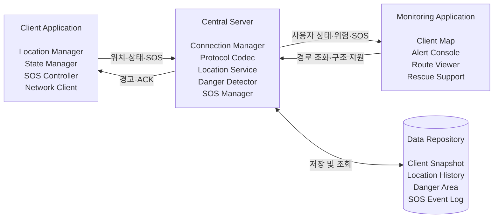

<div align="center">
  <sub>[Figure 2-1] Logical System Architecture</sub>
</div>

---

## 2.1 Client Application

사용자가 실행하는 프로그램으로 자신의 위치와 상태를 서버에 전달한다.

### Responsibilities

- 서버 연결 및 사용자 ID 발급 요청
- 현재 위치 및 상태 데이터 생성
- 위치 또는 상태 변화 시 데이터 전송
- 위험 경고 메시지 수신 및 표시
- SOS 요청 생성 및 전송
- 시스템 종료 시 연결 해제

---

## 2.2 Central Server

클라이언트와 관제 시스템 사이의 통신과 업무 처리를 담당한다.

### Responsibilities

- 클라이언트 및 관제 시스템 연결 관리
- 메시지 프레임 해석 및 유효성 검사
- 사용자 최신 위치와 상태 관리
- 위험 지역 진입 여부 판정
- 위험 경고와 SOS 이벤트 전달
- 사용자 이동 경로 저장 및 조회
- 연결 종료 및 비정상 세션 정리

---

## 2.3 Monitoring Application

관제자가 사용자 위치와 위험 상황을 확인하고 구조를 지원하는 프로그램이다.

### Responsibilities

- 전체 사용자 위치 및 상태 표시
- 위험 사용자 목록 표시
- SOS 요청 우선 표시
- 특정 사용자의 이동 경로 조회
- 구조 지원 처리 및 결과 기록
- 접속 종료 사용자 상태 확인

---

## 2.4 Data Repository

시스템에서 발생하는 상태와 이벤트를 저장하는 계층이다.

### Stored Data

- 사용자 최신 위치 및 상태
- 사용자별 위치 이동 이력
- 위험 지역 좌표 및 위험도
- SOS 요청과 처리 상태
- 접속, 종료, 위험 판정 및 오류 로그

---

# 3. Class Design

## 3.1 Class Diagram

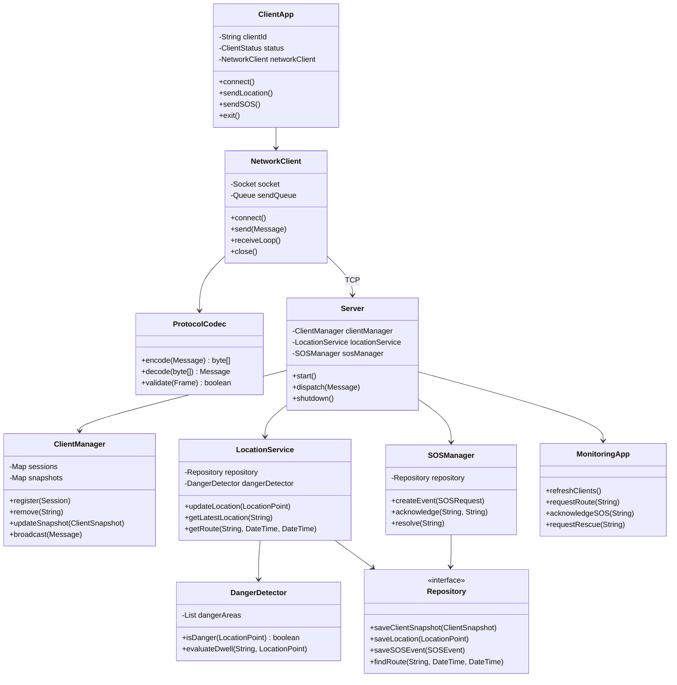

<div align="center">
  <sub>[Figure 3-1] Core Class Diagram</sub>
</div>

---

## 3.2 Class Description

### 3.2.1 ClientApp

클라이언트 프로그램의 실행 흐름과 사용자 입력을 관리한다.

| Member | Description |
|---|---|
| `clientId` | 서버에서 부여한 고유 사용자 ID |
| `status` | 현재 연결 및 위험 상태 |
| `networkClient` | 서버와 통신하는 네트워크 객체 |

| Method | Description |
|---|---|
| `connect()` | 서버에 접속하고 사용자 ID를 발급받는다. |
| `sendLocation()` | 현재 위치와 상태를 서버로 전송한다. |
| `sendSOS()` | 현재 위치가 포함된 SOS 요청을 전송한다. |
| `exit()` | 종료 메시지를 전송하고 프로그램을 종료한다. |

---

### 3.2.2 NetworkClient

클라이언트의 소켓 연결과 메시지 송수신을 담당한다.

| Method | Description |
|---|---|
| `connect()` | 서버에 TCP 연결을 생성한다. |
| `send(Message)` | 메시지를 프로토콜 프레임으로 변환하여 전송한다. |
| `receiveLoop()` | 서버 메시지를 지속적으로 수신한다. |
| `close()` | 소켓과 송수신 자원을 정리한다. |

---

### 3.2.3 ProtocolCodec

통신 메시지의 직렬화, 역직렬화 및 검증을 담당한다.

| Method | Description |
|---|---|
| `encode(Message)` | 메시지를 STX/ETX 기반 바이트 프레임으로 변환한다. |
| `decode(byte[])` | 수신 프레임을 Message 객체로 변환한다. |
| `validate(Frame)` | 길이, 명령 코드 및 체크섬을 검사한다. |

---

### 3.2.4 Server

수신 메시지를 적절한 서비스로 전달하는 중앙 조정자이다.

| Method | Description |
|---|---|
| `start()` | 서버 소켓과 메시지 처리 작업을 시작한다. |
| `dispatch(Message)` | 메시지 종류에 따라 업무 서비스를 호출한다. |
| `shutdown()` | 접속 세션과 작업 스레드를 안전하게 종료한다. |

---

### 3.2.5 ClientManager

접속 사용자와 사용자별 최신 상태를 관리한다.

| Method | Description |
|---|---|
| `register(Session)` | 신규 클라이언트를 등록하고 ID를 생성한다. |
| `remove(String)` | 종료 또는 연결 해제된 클라이언트를 제거한다. |
| `updateSnapshot(ClientSnapshot)` | 사용자의 최신 위치와 상태를 갱신한다. |
| `broadcast(Message)` | 지정된 사용자 또는 관제 시스템에 메시지를 전달한다. |

---

### 3.2.6 LocationService

위치 데이터 저장, 위험 판정 요청 및 이동 경로 조회를 담당한다.

| Method | Description |
|---|---|
| `updateLocation(LocationPoint)` | 위치를 저장하고 위험 여부를 판정한다. |
| `getLatestLocation(String)` | 사용자의 최신 위치를 반환한다. |
| `getRoute(String, DateTime, DateTime)` | 지정 기간의 이동 경로를 반환한다. |

---

### 3.2.7 DangerDetector

사용자 위치와 위험 지역 데이터를 비교한다.

| Method | Description |
|---|---|
| `isDanger(LocationPoint)` | 위치가 위험 구역에 포함되는지 검사한다. |
| `evaluateDwell(String, LocationPoint)` | 위험 지역 체류 시간이 기준을 넘었는지 검사한다. |

---

### 3.2.8 SOSManager

SOS 요청의 생성부터 구조 완료까지 상태를 관리한다.

| Method | Description |
|---|---|
| `createEvent(SOSRequest)` | 새로운 SOS 이벤트를 생성한다. |
| `acknowledge(String, String)` | 관제자가 요청을 확인했음을 기록한다. |
| `resolve(String)` | 구조 처리가 완료된 이벤트를 종료한다. |

---

# 4. Sequence Design

## 4.1 System Connect

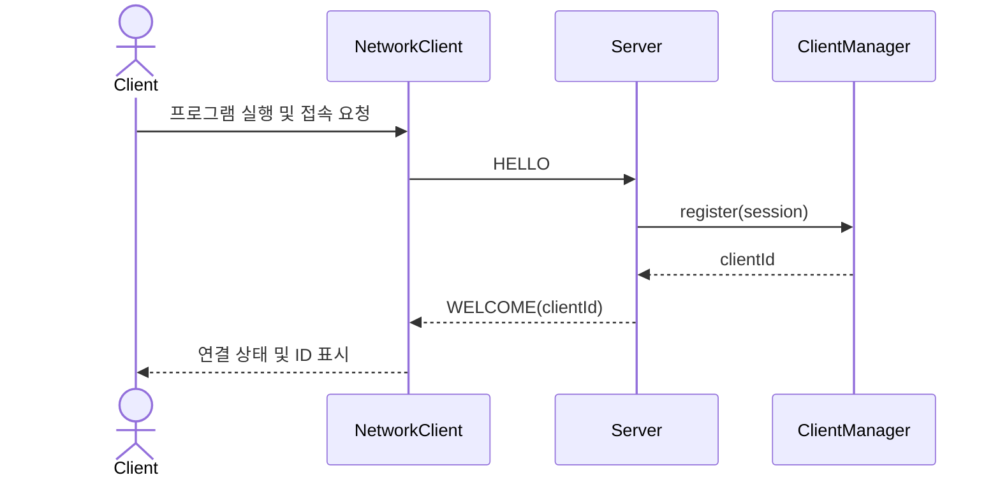

### Processing Steps

1. 사용자가 클라이언트 프로그램을 실행한다.
2. NetworkClient가 서버에 TCP 연결을 시도한다.
3. 클라이언트는 자신의 역할과 장치 정보가 포함된 `HELLO` 메시지를 전송한다.
4. 서버는 새로운 세션을 등록하고 고유한 `clientId`를 생성한다.
5. 서버는 `WELCOME` 메시지로 사용자 ID와 heartbeat 주기를 전달한다.
6. 클라이언트는 연결 완료 상태를 화면에 표시한다.

---

## 4.2 Send Location and State

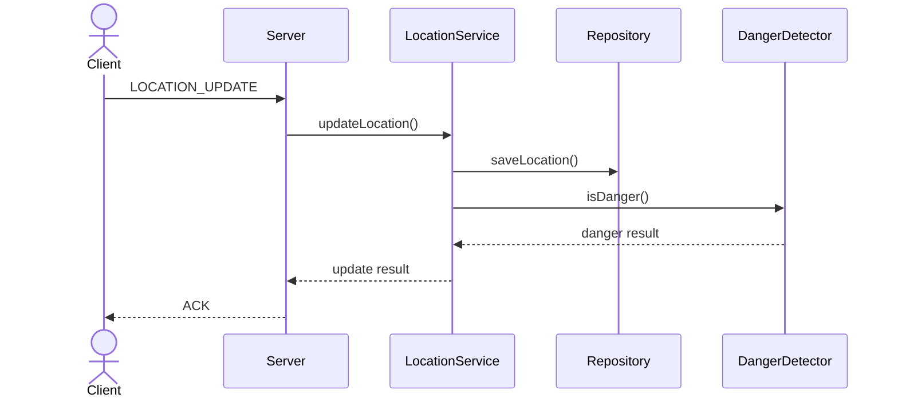

### Processing Steps

1. 클라이언트가 위치와 상태 데이터를 생성한다.
2. `LOCATION_UPDATE` 메시지를 서버로 전송한다.
3. 서버는 데이터 형식과 좌표 범위를 검사한다.
4. LocationService가 위치 이력과 최신 상태를 저장한다.
5. DangerDetector가 위험 지역 포함 여부를 판정한다.
6. 서버가 정상 처리 결과를 `ACK`로 응답한다.

---

## 4.3 Danger Detection and Alert

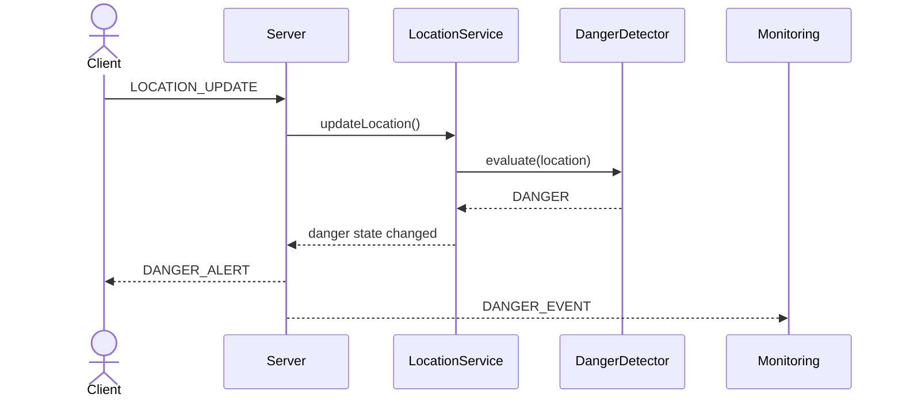

### Processing Steps

1. 서버가 사용자의 최신 위치를 수신한다.
2. 위험 지역 데이터와 사용자 위치를 비교한다.
3. 위험 지역 진입 또는 체류 시간 초과 여부를 판단한다.
4. 이전 상태가 안전이고 현재 상태가 위험인 경우 위험 이벤트를 생성한다.
5. 클라이언트에는 `DANGER_ALERT` 메시지를 전송한다.
6. 관제 시스템에는 사용자 ID, 위치 및 위험도가 포함된 이벤트를 전달한다.

---

## 4.4 Send SOS

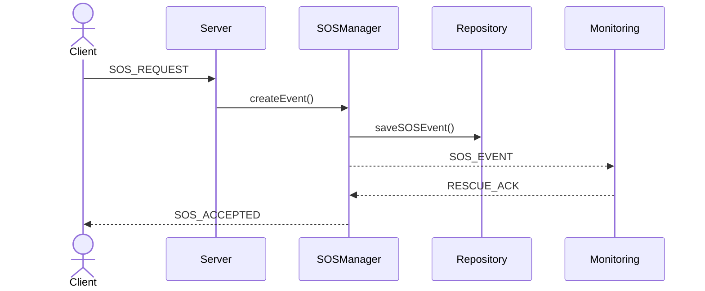

### Processing Steps

1. 사용자가 SOS 버튼을 누른다.
2. 클라이언트는 현재 위치와 상태를 포함한 `SOS_REQUEST`를 전송한다.
3. SOSManager는 고유 이벤트 ID를 생성하고 상태를 `OPEN`으로 저장한다.
4. 서버는 관제 시스템에 `SOS_EVENT`를 우선 전달한다.
5. 관제자가 요청을 확인하면 `RESCUE_ACK`를 전송한다.
6. 클라이언트는 구조 요청 접수 및 확인 상태를 표시한다.

---

## 4.5 Monitoring Clients and Rescue Support

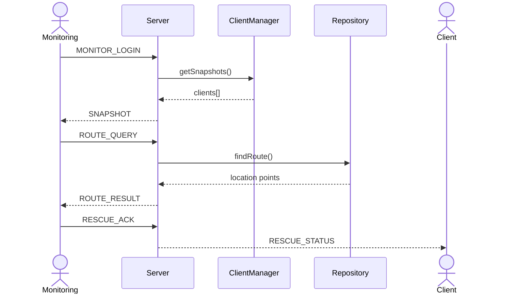

---

## 4.6 System Exit

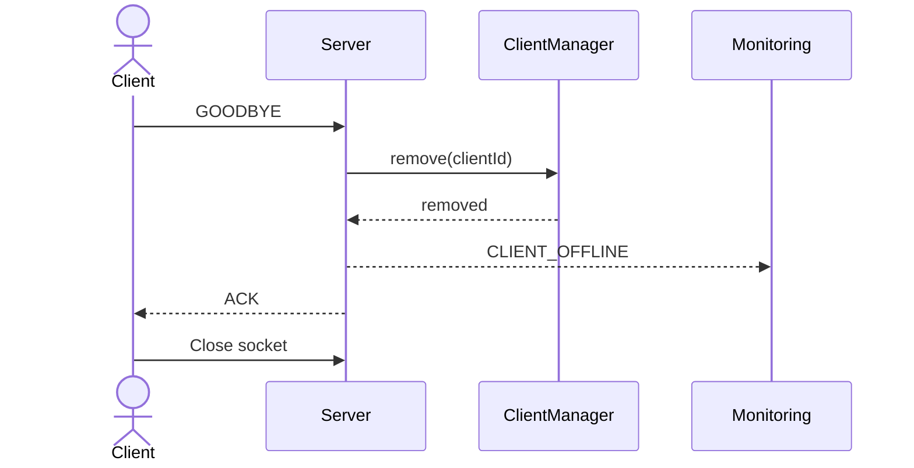

### Exception Flow

- 클라이언트가 정상 종료 메시지를 보내지 못한 경우 heartbeat timeout으로 연결 종료를 감지한다.
- 서버는 비정상 종료된 세션을 제거하고 관제 시스템에 `CLIENT_OFFLINE` 이벤트를 전달한다.

---

# 5. State Machine Design

## 5.1 Client State

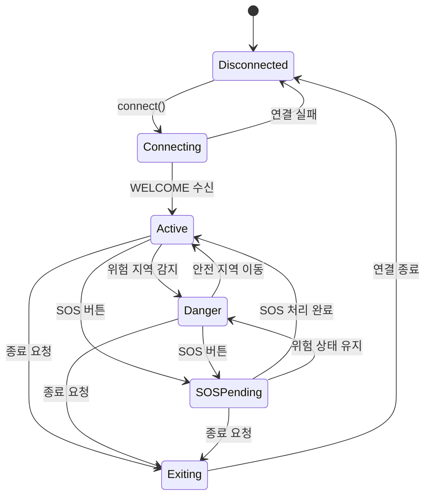

<div align="center">
  <sub>[Figure 5-1] Client State Machine</sub>
</div>

| State | Description |
|---|---|
| `Disconnected` | 서버 연결이 없는 초기 또는 종료 상태 |
| `Connecting` | 서버 연결과 사용자 ID 발급이 진행 중인 상태 |
| `Active` | 위치 및 상태를 정상적으로 전송하는 상태 |
| `Danger` | 위험 지역 진입 또는 위험 체류가 감지된 상태 |
| `SOSPending` | SOS 요청을 전송하고 관제 확인을 기다리는 상태 |
| `Exiting` | 종료 메시지를 전송하고 자원을 정리하는 상태 |

---

## 5.2 SOS Event State

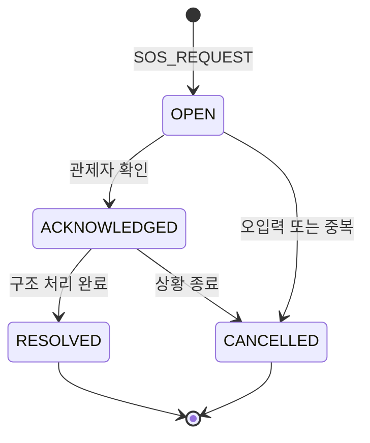

| State | Description |
|---|---|
| `OPEN` | 서버가 SOS 요청을 수신하고 이벤트를 생성한 상태 |
| `ACKNOWLEDGED` | 관제자가 요청을 확인한 상태 |
| `RESOLVED` | 구조 지원 또는 상황 처리가 완료된 상태 |
| `CANCELLED` | 오입력, 중복 또는 상황 종료로 취소된 상태 |

---

# 6. Protocol Design

## 6.1 Communication Method

- Transport Protocol: TCP/IP
- Character Encoding: UTF-8
- Frame Boundary: STX / ETX
- Payload Format: JSON
- Error Detection: Length 및 CRC32
- Delivery Confirmation: Message ID 기반 ACK

---

## 6.2 Message Frame

```text
+------+---------+--------+--------------+------------+-----------+---------+-------+------+
| STX  | Version | Length | Message Type | Message ID | Timestamp | Payload | CRC32 | ETX  |
+------+---------+--------+--------------+------------+-----------+---------+-------+------+
| 1B   | 1B      | 4B     | 2B           | 16B        | 8B        | N Byte  | 4B    | 1B   |
+------+---------+--------+--------------+------------+-----------+---------+-------+------+
```

| Field | Description |
|---|---|
| `STX` | 프레임 시작을 나타내는 `0x02` |
| `Version` | 프로토콜 버전 |
| `Length` | Header 이후 ETX 이전까지의 데이터 길이 |
| `Message Type` | Connect, Location, SOS 등 메시지 종류 |
| `Message ID` | 중복 처리 방지와 ACK 연결을 위한 UUID |
| `Timestamp` | 메시지 생성 시각 |
| `Payload` | 명령에 필요한 실제 데이터 |
| `CRC32` | 전송 데이터 오류 검사 값 |
| `ETX` | 프레임 종료를 나타내는 `0x03` |

---

## 6.3 Message Catalog

| Code | Message | Direction | Description |
|---|---|---|---|
| `0x0001` | `HELLO` | Client → Server | 서버 접속 및 사용자 등록 요청 |
| `0x0002` | `WELCOME` | Server → Client | 사용자 ID와 세션 정보 전달 |
| `0x0010` | `LOCATION_UPDATE` | Client → Server | 위치와 상태 정보 전송 |
| `0x0011` | `DANGER_ALERT` | Server → Client | 위험 지역 진입 경고 |
| `0x0012` | `DANGER_EVENT` | Server → Monitoring | 위험 사용자 정보 전달 |
| `0x0020` | `SOS_REQUEST` | Client → Server | 긴급 구조 요청 |
| `0x0021` | `SOS_EVENT` | Server → Monitoring | SOS 이벤트 전달 |
| `0x0022` | `RESCUE_ACK` | Monitoring → Server | 관제자 확인 및 구조 처리 |
| `0x0030` | `SNAPSHOT` | Server → Monitoring | 전체 사용자 최신 상태 |
| `0x0031` | `ROUTE_QUERY` | Monitoring → Server | 사용자 이동 경로 조회 |
| `0x0032` | `ROUTE_RESULT` | Server → Monitoring | 이동 경로 조회 결과 |
| `0x00F0` | `HEARTBEAT` | Bidirectional | 연결 상태 확인 |
| `0x00FF` | `GOODBYE` | Bidirectional | 정상 연결 종료 |
| `0x7FFE` | `ERROR` | Bidirectional | 오류 코드와 원인 전달 |
| `0x7FFF` | `ACK` | Bidirectional | 메시지 수신 및 처리 확인 |

---

## 6.4 Payload Examples

### HELLO

```json
{
  "role": "CLIENT",
  "deviceId": "device-001",
  "appVersion": "1.0.0"
}
```

### LOCATION_UPDATE

```json
{
  "clientId": "C-0001",
  "location": {
    "x": 127.0276,
    "y": 37.4979,
    "accuracy": 5.5
  },
  "state": "NORMAL",
  "capturedAt": "2026-06-05T12:30:15Z"
}
```

### SOS_REQUEST

```json
{
  "clientId": "C-0001",
  "location": {
    "x": 127.0276,
    "y": 37.4979
  },
  "state": "DANGER",
  "message": "긴급 구조 요청"
}
```

---

# 7. Data Design

## 7.1 Entity Relationship

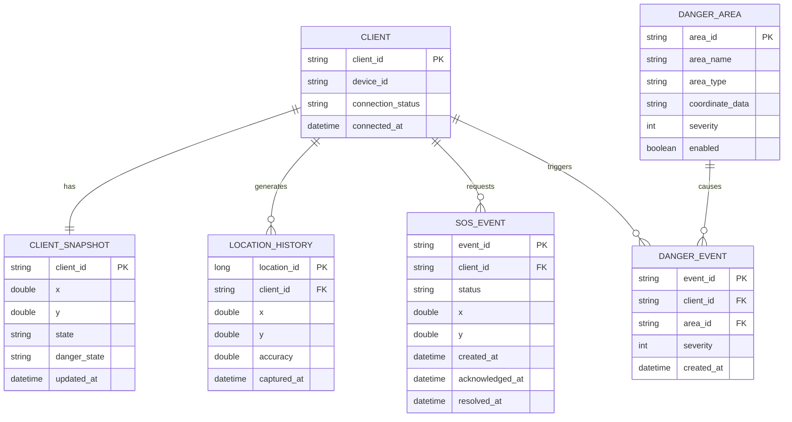

---

## 7.2 Data Entity Description

### ClientSnapshot

| Field | Type | Description |
|---|---|---|
| `clientId` | String | 사용자 고유 ID |
| `location` | LocationPoint | 최신 위치 |
| `state` | ClientState | 사용자 상태 |
| `dangerState` | DangerState | 안전 또는 위험 상태 |
| `updatedAt` | DateTime | 마지막 갱신 시각 |

### LocationPoint

| Field | Type | Description |
|---|---|---|
| `x` | Double | 경도 또는 X 좌표 |
| `y` | Double | 위도 또는 Y 좌표 |
| `accuracy` | Double | 위치 정확도 |
| `capturedAt` | DateTime | 위치 측정 시각 |

### DangerArea

| Field | Type | Description |
|---|---|---|
| `areaId` | String | 위험 지역 고유 ID |
| `areaName` | String | 위험 지역 이름 |
| `areaType` | Enum | 원형 또는 다각형 |
| `coordinateData` | Object | 중심점·반경 또는 다각형 좌표 |
| `severity` | Integer | 위험도 |
| `enabled` | Boolean | 위험 판정 활성화 여부 |

### SOSEvent

| Field | Type | Description |
|---|---|---|
| `eventId` | String | SOS 이벤트 고유 ID |
| `clientId` | String | 요청 사용자 ID |
| `location` | LocationPoint | 요청 발생 위치 |
| `status` | SOSStatus | 처리 상태 |
| `createdAt` | DateTime | 요청 시각 |
| `acknowledgedAt` | DateTime | 관제 확인 시각 |
| `resolvedAt` | DateTime | 처리 완료 시각 |

---

# 8. User Interface Design

## 8.1 Client Main Screen

```text
+--------------------------------------------------+
| Real Time Location System                        |
+--------------------------------------------------+
| Connection : CONNECTED                           |
| Client ID  : C-0001                              |
|                                                  |
| Current Location                                 |
| X : 127.0276                                     |
| Y : 37.4979                                      |
|                                                  |
| Current State : NORMAL                           |
| Last Update   : 2 seconds ago                    |
|                                                  |
|                 [ SEND SOS ]                     |
|                                                  |
| [ Connect ]                         [ Exit ]      |
+--------------------------------------------------+
```

### Components

- 서버 연결 상태
- 사용자 고유 ID
- 현재 위치
- 현재 안전 및 위험 상태
- 마지막 위치 전송 시각
- SOS 요청 버튼
- 연결 및 종료 버튼

---

## 8.2 Danger Alert Screen

```text
+--------------------------------------------------+
|                 DANGER ALERT                     |
+--------------------------------------------------+
| 위험 지역에 진입했습니다.                        |
|                                                  |
| Danger Area : AREA-03                            |
| Severity    : HIGH                               |
| Location    : 127.0276, 37.4979                 |
|                                                  |
| 안전한 지역으로 이동하십시오.                    |
|                                                  |
| [ Confirm ]                         [ SOS ]       |
+--------------------------------------------------+
```

---

## 8.3 Monitoring Dashboard

```text
+--------------------------------------------------------------+
| REAL-TIME MONITORING                  Connected Clients : 24 |
+--------------------------------------+-----------------------+
|                                      | Active Alerts         |
|                                      |                       |
|              Live Map                | SOS-003      CRITICAL |
|                                      | C-014        DANGER   |
|  - Client markers                    | C-021        DANGER   |
|  - Danger area overlay               |                       |
|  - Selected client route             +-----------------------+
|                                      | Client Detail         |
|                                      |                       |
|                                      | ID     : C-014        |
|                                      | State  : DANGER       |
|                                      | Update : 2 sec ago    |
|                                      |                       |
|                                      | [Route] [Rescue]      |
+--------------------------------------+-----------------------+
| Event Timeline                                                |
| 14:32 Danger detected | 14:33 Alert sent | 14:34 Rescue ACK  |
+--------------------------------------------------------------+
```

### Dashboard Components

| Area | Description |
|---|---|
| Live Map | 사용자 위치, 위험 구역 및 이동 경로 표시 |
| Active Alerts | SOS와 위험 이벤트를 우선순위에 따라 표시 |
| Client Detail | 선택 사용자의 위치, 상태 및 마지막 갱신 정보 |
| Route | 시간순 사용자 이동 경로 조회 |
| Rescue | 구조 지원 요청 및 처리 상태 변경 |
| Event Timeline | 위험 감지, 경고, 확인 및 구조 처리 이력 |

---

## 8.4 UI Design Rules

- SOS 이벤트는 일반 위험 경고보다 높은 우선순위로 표시한다.
- 색상만으로 상태를 구분하지 않고 텍스트와 아이콘을 함께 사용한다.
- 마지막 갱신 시간이 임계값을 넘으면 `STALE` 상태로 표시한다.
- 구조 지원 실행 전 사용자 ID와 이벤트 ID를 다시 확인한다.
- 위험 팝업에는 위험 지역, 현재 위치 및 행동 지침을 함께 표시한다.

---

# 9. Concurrency and Error Handling

## 9.1 Multi-Thread Structure

| Execution Unit | Responsibility |
|---|---|
| Accept Thread | 신규 클라이언트 및 관제 연결 수락 |
| Session Reader | 연결별 메시지 수신과 프레임 해석 |
| Event Dispatcher | 메시지 유형에 따른 업무 서비스 호출 |
| Session Writer | 연결별 송신 큐의 메시지 전송 |
| Persistence Worker | 위치 이력 및 로그 저장 |
| Heartbeat Worker | 연결 생존 여부 확인 |

---

## 9.2 Thread Processing Flow

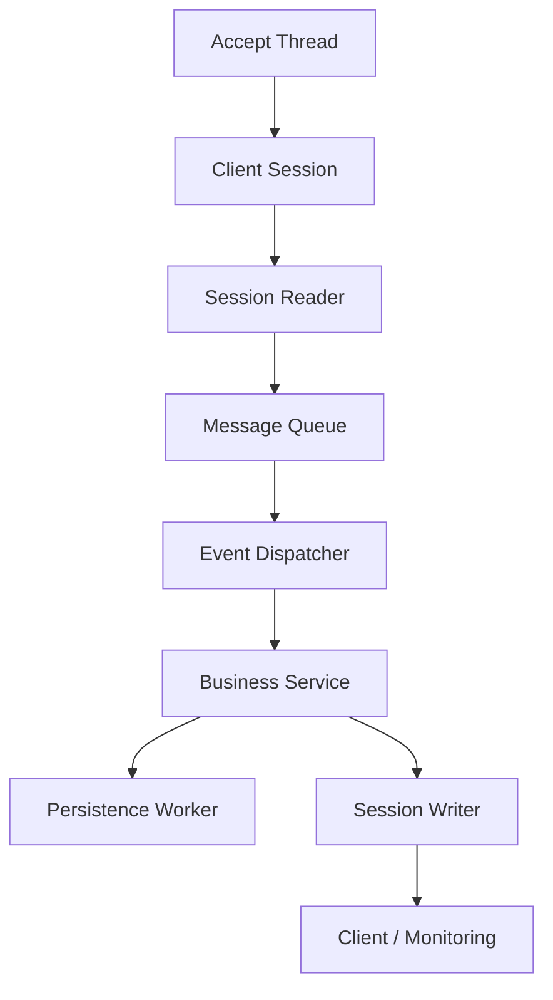

---

## 9.3 Synchronization Rules

- 접속 사용자 목록은 thread-safe collection 또는 mutex로 보호한다.
- 사용자별 최신 상태 변경은 하나의 원자적 작업으로 처리한다.
- 동일한 `messageId`가 재수신되면 이전 처리 결과를 반환한다.
- 느린 클라이언트의 송신 작업이 다른 사용자 처리를 지연시키지 않도록 연결별 송신 큐를 사용한다.
- SOS 이벤트 저장과 관제 전달은 일반 위치 이력보다 높은 우선순위로 처리한다.

---

## 9.4 Error Handling

| Failure | Detection | Recovery |
|---|---|---|
| 서버 연결 실패 | Connection timeout | 일정 시간 후 재접속 |
| 메시지 손상 | Length 또는 CRC 오류 | 프레임 폐기 및 ERROR 응답 |
| 잘못된 좌표 | 좌표 범위 검사 실패 | 저장하지 않고 오류 응답 |
| ACK 미수신 | Message timeout | 중요 메시지 재전송 |
| 비정상 연결 종료 | EOF 또는 heartbeat timeout | 세션 제거 및 OFFLINE 이벤트 |
| 오래된 위치 데이터 | Timestamp 비교 | 최신 상태를 변경하지 않고 이력 정책에 따라 처리 |
| 저장 실패 | Repository exception | 메모리 큐에 보관 후 재시도 |

---

# 10. Security Design

위치와 상태 데이터는 사용자의 민감정보이므로 다음 보안 기준을 적용한다.

## 10.1 Transport Security

- 실제 배포 환경에서는 TLS를 사용한다.
- 평문 위치 데이터 전송을 허용하지 않는다.
- 서버 인증서를 검증하여 중간자 공격을 방지한다.

## 10.2 Authentication and Authorization

- Client와 Monitoring 역할을 구분한다.
- 관제 시스템은 별도의 운영자 인증을 수행한다.
- 사용자 위치 조회와 구조 지원 기능은 권한이 있는 관제자만 실행할 수 있다.
- 구조 명령에는 운영자 ID와 처리 시각을 기록한다.

## 10.3 Input Validation

- 최대 메시지 크기를 제한한다.
- 좌표와 시간 값의 유효 범위를 검사한다.
- 문자열 길이와 허용 문자 범위를 검사한다.
- 비정상적으로 빠른 메시지 전송을 제한한다.

## 10.4 Privacy

- 위치 이력은 목적에 필요한 기간만 저장한다.
- 사용자 식별 정보와 위치 데이터의 접근 권한을 분리한다.
- 위치 조회 및 구조 지원 이력을 감사 로그로 저장한다.
- 보고서나 테스트 데이터에서는 실제 개인정보를 사용하지 않는다.

---

# 11. Implementation Requirements

## 11.1 Hardware Requirements

| Item | Minimum Requirement | Recommended |
|---|---|---|
| CPU | Intel Pentium IV 이상 | 4 Core x64 Processor |
| RAM | 1 GB 이상 | 8 GB 이상 |
| Storage | 10 GB 여유 공간 | SSD 20 GB 이상 |
| Network | TCP/IP 연결 | 안정적인 LAN 또는 WAN |

---

## 11.2 Software Requirements

| Item | Requirement |
|---|---|
| Operating System | Windows 7 이상 또는 Linux |
| Implementation Language | 프로젝트 저장소에서 사용하는 C/C++ 또는 Java |
| Network API | Winsock2 또는 표준 Socket API |
| Build Tool | Visual Studio, CMake, Gradle 또는 프로젝트 기존 도구 |
| Map API | OpenStreetMap 또는 Google Maps Platform |
| Documentation | Markdown 및 Mermaid 지원 GitHub Repository |

---

## 11.3 Nonfunctional Requirements

| Requirement | Target |
|---|---|
| Location Processing Latency | 95%의 요청이 1초 이내 관제 화면에 반영 |
| SOS Delivery Latency | 95%의 요청이 500ms 이내 관제 시스템에 전달 |
| Danger Alert Latency | 위치 수신 후 1초 이내 경고 전달 |
| Concurrent Clients | 초기 목표 100개 동시 세션 |
| Reconnection Recovery | 재접속 후 5초 이내 최신 상태 동기화 |
| Availability | 단일 연결 오류가 다른 사용자에게 영향을 주지 않아야 함 |

---

## 11.4 Implementation Order

1. Message 모델과 ProtocolCodec을 구현한다.
2. 서버 연결, 사용자 ID 발급 및 heartbeat를 구현한다.
3. 위치 및 상태 전송과 사용자 최신 상태 관리를 구현한다.
4. 위치 이력 저장과 관제 시스템 사용자 목록을 구현한다.
5. DangerDetector와 위험 경고 기능을 구현한다.
6. SOS 이벤트와 관제 확인 상태를 구현한다.
7. 사용자 이동 경로 조회 기능을 구현한다.
8. 연결 종료, 오류 복구 및 재접속 기능을 구현한다.
9. 동시 접속 및 네트워크 장애 통합 테스트를 수행한다.

---

## 11.5 Acceptance Checklist

- [ ] 사용자가 서버에 접속하면 고유 ID가 발급된다.
- [ ] 위치 및 상태 정보가 서버에 저장된다.
- [ ] 위험 지역 진입 시 클라이언트와 관제 시스템에 경고가 전달된다.
- [ ] SOS 요청이 관제 시스템에 우선 전달된다.
- [ ] 관제자가 전체 사용자 위치와 상태를 확인할 수 있다.
- [ ] 특정 사용자의 이동 경로를 조회할 수 있다.
- [ ] 구조 지원 확인 상태가 클라이언트에 전달된다.
- [ ] 정상 및 비정상 종료 시 세션과 자원이 정리된다.
- [ ] 손상된 메시지와 중복 메시지가 안전하게 처리된다.
- [ ] 다수의 클라이언트가 동시에 접속해도 기능이 정상 동작한다.

---

# 12. Glossary

| Term | Description |
|---|---|
| Client | 위치와 상태를 전송하고 경고를 수신하는 사용자 프로그램 |
| Monitoring | 사용자를 관제하고 구조 지원을 수행하는 운영자 프로그램 |
| Server | 데이터 처리와 메시지 전달을 담당하는 중앙 시스템 |
| Client Snapshot | 특정 사용자의 최신 위치와 상태 정보 |
| Location History | 시간순으로 저장된 사용자 위치 이력 |
| Danger Area | 위험 판정에 사용되는 지리적 영역 |
| Danger Event | 사용자가 위험 지역에 진입하거나 체류하여 생성된 이벤트 |
| SOS Event | 긴급 구조 요청과 처리 상태를 포함하는 이벤트 |
| Protocol | 시스템 간 데이터 전송 규칙 |
| STX | 메시지 프레임의 시작을 나타내는 제어 문자 |
| ETX | 메시지 프레임의 끝을 나타내는 제어 문자 |
| ACK | 메시지 수신 또는 처리 완료 확인 |
| Heartbeat | 연결 생존 여부를 확인하는 주기 메시지 |
| Thread | 프로그램 내부의 독립적인 실행 흐름 |
| Repository | 데이터 저장 방식과 업무 로직을 분리하는 인터페이스 |
| TLS | 네트워크 전송 구간을 암호화하는 보안 프로토콜 |

---

# 13. References

- Real Time Location System - Conceptualization Document
- Real Time Location System - Analysis Document
- Design Example 1 - Always be there Design Document
- GitHub Repository: https://github.com/xweoze/real-time-monitoring-system
- Microsoft Learn - Winsock2 API
- TCP/IP Socket Programming Reference
- OpenStreetMap API Documentation
- Google Maps Platform Documentation
- Mermaid Diagram Documentation
- UML 2.x Class, Sequence and State Machine Diagram

