<!-- 22212023 컴퓨터공학과 김지훈 -->
<!-- GitHub Repository: https://github.com/xweoze/real-time-monitoring-system -->

# Real Time Location System

## Design Document

---

### Disaster Vulnerable Population Real-Time Monitoring System

재난 상황 취약계층 실시간 위치 및 상태 모니터링 시스템

---

## [ Revision history ]

| Revision date | Version # | Description | Author |
|---|---|---|---|
| 2026-03-27 | 0.01 | Conceptualization 초안 작성 | 김지훈 |
| 2026-03-29 | 0.50 | Analysis Document 기반 구조 반영 | 김지훈 |
| 2026-06-05 | 1.00 | Design Document 작성 | 김지훈 |
| 2026-06-11 | 1.10 | 실제 Python 웹 구현 기준으로 설계 전면 보완 | 김지훈 |
| 2026-06-13 | 1.20 | 인증·회원 관리·지역 관제·공공데이터 설계 반영 | 김지훈 |

---

# [ Contents ]

1. Introduction
2. System Architecture
3. Component Design
4. Sequence Design
5. State Design
6. API Design
7. Data Design
8. User Interface Design
9. Concurrency and Error Handling
10. Security and Privacy
11. Nonfunctional Requirements
12. Requirements Traceability
13. Glossary
14. References

---

# 1. Introduction

본 문서는 Conceptualization 단계와 Analysis 단계에서 정의한 요구사항을 실제 구현 구조로 구체화한다. 현재 시스템은 Python 표준 라이브러리 기반 HTTP 서버, HTML/CSS/JavaScript 사용자 앱, 관제 대시보드와 인메모리 저장소로 구성된 시연용 MVP이다.

## 1.1 Design Goals

- 사용자 위치와 상태를 HTTP/JSON으로 안전하게 검증하고 처리한다.
- 위험 지역 진입 여부를 서버에서 일관되게 판정한다.
- 상태 변경을 SSE로 관제 화면에 빠르게 알린다.
- SOS 요청을 접수, 확인, 완료 상태로 관리한다.
- 사용자 ID 기반 데이터 조회와 갱신을 단순하고 빠르게 처리한다.
- 현재 구현과 운영 환경에서 필요한 확장 항목을 명확히 구분한다.

## 1.2 Design Scope

| Scope | Current MVP |
|---|---|
| Client Application | 회원가입·로그인, 위치 전송, 위험 경고, SOS와 로그아웃 |
| Central Server | 인증·권한 검사, HTTP API, 위험 판정, 상태 저장과 SSE 발행 |
| Monitoring Application | 전국·지역 관제, 회원 관리, 공공 알림, 경로와 SOS 처리 |
| Data Storage | SQLite 계정·세션, 메모리 인덱스와 SQLite 상태 스냅샷 |
| Communication | HTTP/JSON 요청·응답과 SSE 이벤트 |

## 1.3 Out of Scope

- 실제 119 또는 공공 구조기관 자동 신고
- 다중 서버 구성과 운영용 관계형 데이터베이스
- 도로·건물 배경 지도 API와 주소 검색
- 모바일 백그라운드 위치 전송
- 상용 수준의 SLA와 재난 대응 인증

---

# 2. System Architecture

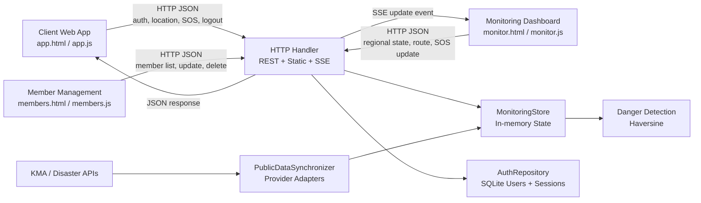

## 2.1 Client Web Application

사용자 앱은 계정 인증 후 브라우저 위치 API 또는 입력 좌표를 사용한다.

- 회원가입 시 아이디, 비밀번호, 이름, 지역과 선택형 생년월일·성별 저장
- 로그인 성공 시 `localStorage`에 Bearer 토큰과 공개 사용자 정보 저장
- 인증된 계정 ID와 관제 단말 ID를 연결
- 위도, 경도, 정확도와 측정 시각 전송
- 서버가 반환한 위험 상태 표시
- SOS 버튼을 3초간 눌러 오입력 방지
- 서버 세션이 만료되거나 유효하지 않으면 로그인 화면으로 복귀
- 사용자가 선택하면 브라우저 위치 변경을 자동 전송
- 15초 주기 heartbeat로 연결 생존 상태 갱신

## 2.2 Monitoring Dashboard

- 접속 사용자, 위험 사용자, 활성 SOS와 이벤트 수 표시
- 전국 17개 시·도 통합 현황과 지역별 필터
- 전국 관리자와 지역 관리자 역할별 데이터 범위 제한
- 사용자 최신 위치와 위험 지역 표시
- 사용자 검색과 상세 정보 제공
- 최근 이동 경로 조회
- SOS `OPEN → ACKNOWLEDGED → RESOLVED` 처리
- SSE 연결 상태와 재연결 상태 표시
- 금일 이벤트 유형·내용·발생 시각 상세 조회
- 왼쪽 메뉴에서 회원 정보 관리와 지역 관리자 관리 접근

## 2.3 Member Management Application

- 전국 관리자는 전체 회원, 지역 관리자는 담당 지역 회원만 조회
- 이름, 생년월일, 성별과 관리 지역 수정
- 회원 삭제 시 세션과 연결된 단말·경로·SOS 데이터 정리
- 검색, 지역 필터, 접속 상태와 가입일 표시

## 2.4 HTTP Handler

`Handler`는 다음 책임을 가진다.

- URL과 HTTP 메서드에 따라 요청 라우팅
- JSON 본문 읽기와 최대 크기 제한
- API 오류를 HTTP 상태 코드와 JSON으로 반환
- HTML, CSS, JavaScript 정적 파일 제공
- SSE 구독 연결 유지와 heartbeat 전송
- Bearer 토큰 인증, 역할과 지역 권한 검사
- 회원 정보 수정·삭제와 공공데이터 즉시 동기화 라우팅

## 2.5 MonitoringStore

`MonitoringStore`는 핵심 업무 상태를 관리한다.

- 사용자 등록과 최신 상태 갱신
- 위치 이력 저장
- 위험 지역 판정
- SOS 생성과 상태 갱신
- 접속 종료 처리
- 이벤트 타임라인과 SSE 이벤트 발행
- 공유 데이터에 대한 재진입 Lock 적용
- `userId → clientId`, `regionId → set[clientId]` 인덱스 관리
- 공공 알림 upsert, 지역 필터와 만료 처리
- 시작 시 실제 계정과 연결되지 않은 단말 정리

## 2.6 AuthRepository and PublicDataSynchronizer

`AuthRepository`는 SQLite의 `users`, `sessions` 테이블과 PBKDF2 비밀번호 해싱,
12시간 세션, 회원·지역 관리자 관리를 담당한다. `PublicDataSynchronizer`는 기관별
JSON, XML 또는 텍스트 응답을 공통 `PublicAlert` 구조로 변환하고 기본 5분 주기로
관제 저장소에 반영한다.

---

# 3. Component Design

## 3.1 Component Diagram

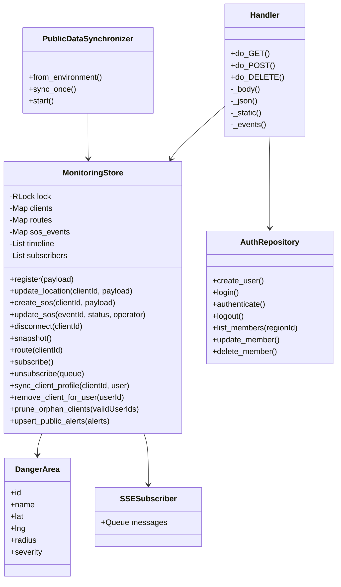

## 3.2 Function Responsibilities

| Function | Responsibility |
|---|---|
| `distance_m()` | Haversine 공식으로 두 GPS 좌표 사이 거리 계산 |
| `register()` | 고유 사용자 ID 생성과 초기 상태 저장 |
| `update_location()` | 좌표 검증, 위치 이력 추가, 위험 상태 판정 |
| `create_sos()` | 최신 위치가 있는 사용자의 SOS 이벤트 생성 |
| `update_sos()` | 관제자의 SOS 접수·완료·취소 처리 |
| `snapshot()` | 관제 화면에 필요한 전체 최신 상태 반환 |
| `route()` | 사용자별 최근 위치 이력 반환 |
| `_publish()` | 각 SSE 구독 큐에 상태 변경 메시지 발행 |
| `authenticate()` | Bearer 토큰 해시와 만료 시각을 검증하고 공개 사용자 정보 반환 |
| `update_member()` | 회원 프로필을 검증하고 SQLite 계정을 수정 |
| `prune_orphan_clients()` | 실제 회원 계정과 연결되지 않은 과거 단말과 관련 데이터 제거 |
| `upsert_public_alerts()` | 기관·원본 ID 기준 공공 알림을 추가 또는 갱신 |

## 3.3 Future Separation

현재는 MVP의 단순성을 위해 저장, 위험 판정과 SOS 처리가 `MonitoringStore`에 모여 있다. 기능 규모가 커지면 다음 계층으로 분리한다.

- `ClientService`
- `LocationService`
- `DangerDetectionService`
- `SOSService`
- `Repository`
- `EventPublisher`

---

# 4. Sequence Design

## 4.1 System Connect

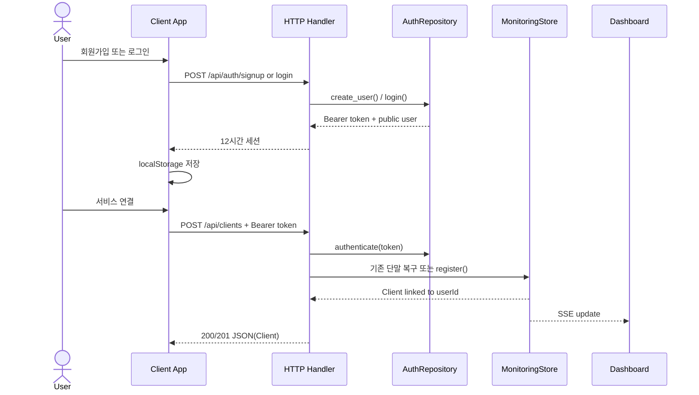

## 4.2 Send Location and Detect Danger

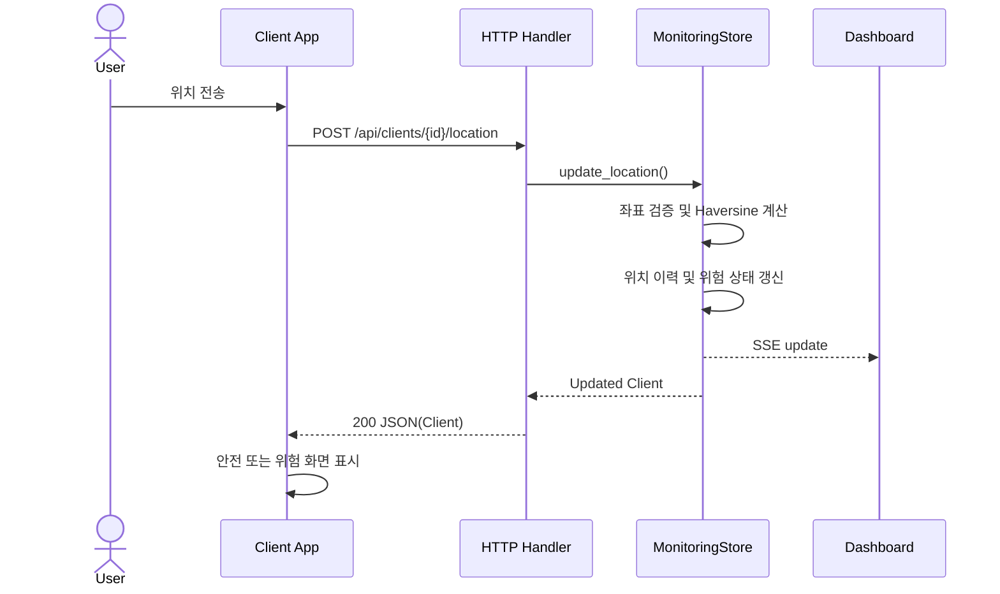

## 4.3 Send and Process SOS

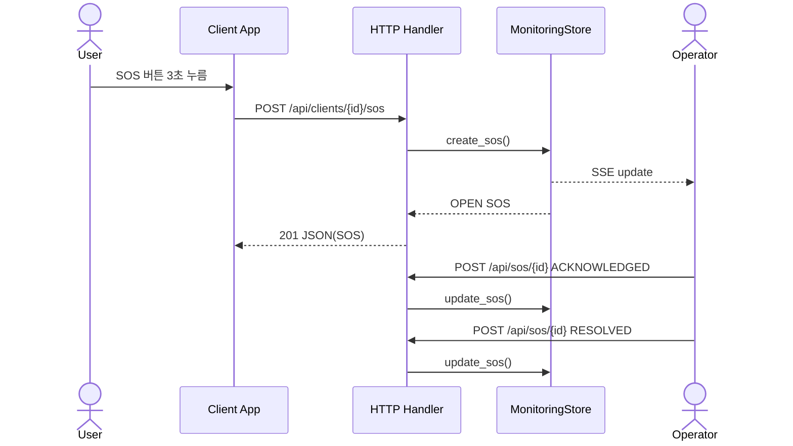

현재 사용자 앱은 SOS 생성 성공만 표시하며 이후 관제 처리 상태를 실시간으로 수신하지 않는다. 사용자 대상 구조 진행 알림은 향후 확장 기능이다.

## 4.4 View Client Route

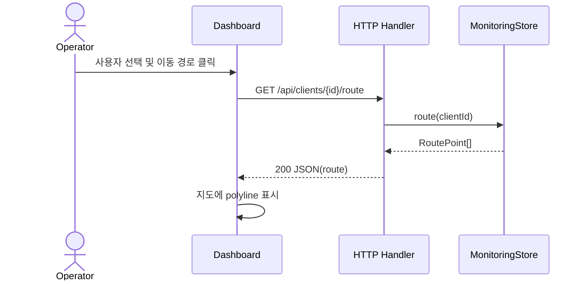

## 4.5 Disconnect

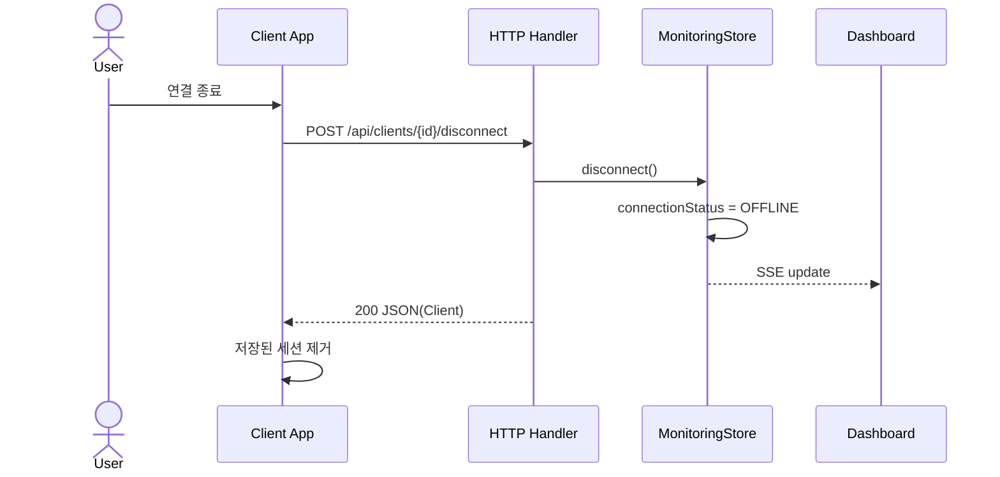

브라우저는 15초마다 heartbeat를 전송한다. 서버는 관제 화면의 주기 상태 조회 시 마지막 heartbeat가 45초를 넘은 사용자를 `OFFLINE`으로 전환한다.

---

# 5. State Design

## 5.1 Client Connection and Danger State

접속 상태와 위험 상태는 서로 다른 속성으로 관리한다.

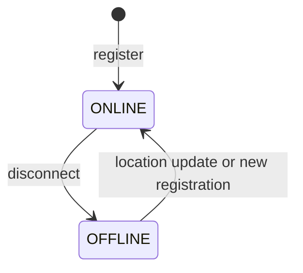

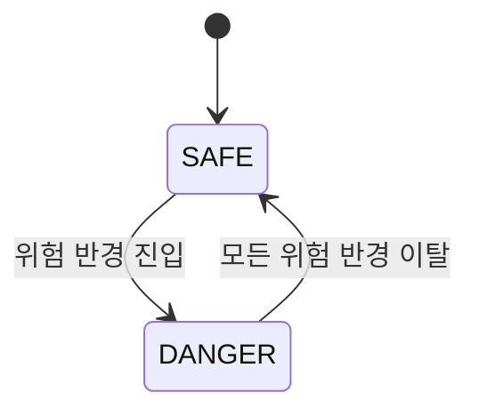

## 5.2 SOS State

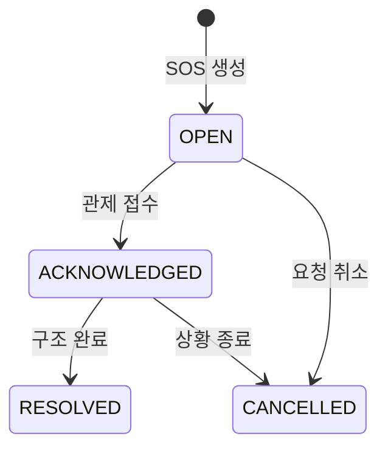

서버는 현재 상태에 따른 허용 전이를 검증하여 `OPEN` 상태에서 바로 `RESOLVED`로 건너뛰는 요청 등을 거부한다.

---

# 6. API Design

## 6.1 Communication Method

- Request/Response: HTTP
- Payload: JSON, UTF-8
- Real-time Notification: SSE
- Static Resources: HTTP GET
- API Cache Policy: `no-store`

HTTP가 메시지 경계, 길이와 전송 오류 처리를 담당하므로 별도의 STX/ETX, CRC32 프레임은 사용하지 않는다.

## 6.2 Endpoint Catalog

| Method | Endpoint | Purpose | Success |
|---|---|---|---|
| `GET` | `/api/regions` | 대한민국 17개 시·도 기준 정보 | `200` |
| `GET` | `/api/auth/me` | 현재 로그인 사용자 확인 | `200` |
| `GET` | `/api/state?region=` | 권한 범위의 최신 상태 조회 | `200` |
| `GET` | `/api/events` | SSE 상태 변경 구독 | `200` |
| `GET` | `/api/members?region=` | 관리자 회원 목록 조회 | `200` |
| `GET` | `/api/operators` | 지역 관리자 목록 조회 | `200` |
| `GET` | `/api/clients/{id}/route` | 사용자 이동 경로 조회 | `200` |
| `POST` | `/api/auth/signup` | 일반 사용자 회원가입과 세션 발급 | `201` |
| `POST` | `/api/auth/login` | 로그인과 12시간 세션 발급 | `200` |
| `POST` | `/api/auth/logout` | 현재 서버 세션 폐기 | `200` |
| `POST` | `/api/operators` | 지역 관리자 계정 생성 | `201` |
| `POST` | `/api/members/{id}` | 회원 프로필 수정 | `200` |
| `DELETE` | `/api/members/{id}` | 회원과 연결 데이터 삭제 | `200` |
| `POST` | `/api/public-alerts` | 표준 공공 알림 직접 등록 | `201` |
| `POST` | `/api/public-alerts/sync` | 설정된 공급자 즉시 동기화 | `200` |
| `POST` | `/api/clients` | 인증된 회원의 단말 연결 | `200/201` |
| `POST` | `/api/clients/{id}/location` | 위치와 상태 갱신 | `200` |
| `POST` | `/api/clients/{id}/sos` | SOS 생성 | `201` |
| `POST` | `/api/clients/{id}/heartbeat` | 연결 생존 상태 갱신 | `200` |
| `POST` | `/api/clients/{id}/disconnect` | 접속 종료 | `200` |
| `POST` | `/api/sos/{id}` | SOS 상태 변경 | `200` |

## 6.3 Payload Examples

### Signup and Client Connection

```json
{
  "username": "user_01",
  "password": "password123",
  "displayName": "김지훈",
  "regionId": "KR-11",
  "birthDate": "1950-05-20",
  "gender": "FEMALE"
}
```

단말 연결 요청에는 `deviceId`만 전달하며 이름, 사용자 ID, 지역과 프로필은 인증된
계정에서 서버가 주입한다.

### Location Update

```json
{
  "lat": 37.4979,
  "lng": 127.0276,
  "accuracy": 5.5,
  "state": "NORMAL",
  "capturedAt": "2026-06-11T12:30:15Z"
}
```

### SOS Request

```json
{
  "message": "사용자 앱 긴급 구조 요청"
}
```

### SOS Status Update

```json
{
  "status": "ACKNOWLEDGED",
  "operator": "관제 요원"
}
```

## 6.4 Error Response

```json
{
  "error": "유효하지 않은 좌표입니다."
}
```

| Status | Meaning |
|---|---|
| `400` | JSON, 좌표, SOS 상태 또는 요청 데이터 오류 |
| `401` | 로그인 세션 없음, 만료 또는 잘못된 토큰 |
| `403` | 역할 또는 담당 지역 밖의 데이터 접근 |
| `404` | 사용자, SOS 이벤트, API 또는 정적 파일을 찾을 수 없음 |

---

# 7. Data Design

## 7.1 In-memory Data Model

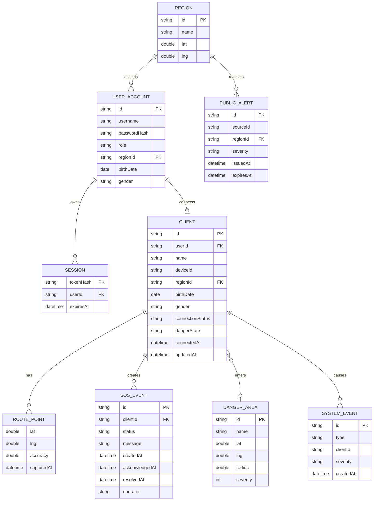

## 7.2 Data Structures

| Data | Structure | Limit | Main Complexity |
|---|---|---:|---|
| User Accounts | SQLite `users` | 운영 정책 기준 | username 인덱스 조회 |
| Login Sessions | SQLite `sessions` | 12시간 만료 | token hash 조회 |
| Clients | `dict[clientId, Client]` | None in MVP | 평균 조회·갱신 `O(1)` |
| Client by User | `dict[userId, clientId]` | 회원당 현재 단말 1개 | 평균 조회 `O(1)` |
| Clients by Region | `dict[regionId, set[clientId]]` | 17개 지역 | 지역 조회 `O(k)` |
| Routes | `dict[clientId, list[RoutePoint]]` | 사용자당 500 | 조회 `O(k)` |
| SOS Events | `dict[sosId, SosEvent]` | None in MVP | 평균 조회·갱신 `O(1)` |
| Timeline | `list[SystemEvent]` | 100 | 앞 삽입과 절단 `O(n)` |
| Danger Areas | `list[DangerArea]` | 현재 기본값 0 | 위치 갱신당 `O(d)` |
| Public Alerts | `dict[source:id, PublicAlert]` | 공급자 응답 기준 | 평균 upsert `O(1)` |
| Subscribers | `list[Queue]` | 연결 수 | 이벤트 발행 `O(s)` |

SQLite에는 계정·세션 테이블과 전체 관제 상태 스냅샷을 저장한다. 서버 시작 시
실제 회원 ID 집합과 단말을 대조해 고아 단말을 제거한다. 운영 버전에서는 정규화된
관제 테이블, `deque`, 공간 인덱스와 데이터 보존 정책을 사용한다.

## 7.3 Danger Detection Algorithm

1. 위도와 경도 범위를 검증한다.
2. 각 위험 지역 중심과 사용자 위치 사이 거리를 Haversine 공식으로 계산한다.
3. `distance <= radius`이면 위험 지역 내부로 판정한다.
4. 여러 위험 지역이 겹치면 심각도가 가장 높은 지역을 선택한다.
5. 이전 위험 상태와 달라진 경우에만 진입 또는 이탈 이벤트를 생성한다.

## 7.4 Retention

현재 위치 이력 500개와 이벤트 100개 제한은 메모리 보호를 위한 시연 정책이다. 실제 운영에서는 보존 기간, 삭제 기준, 법적 근거와 사용자 동의를 별도로 정의해야 한다.

---

# 8. User Interface Design

## 8.1 Client App

- 연결 전에는 로그인·회원가입 탭과 계정 입력 폼을 표시한다.
- 회원가입 시 지역과 선택형 생년월일·성별을 입력한다.
- 연결 후 안전 상태, 사용자 ID, 마지막 갱신 시각과 좌표를 표시한다.
- 위험 상태는 색상뿐 아니라 제목, 기호와 안내 문구로 표시한다.
- SOS는 3초 누르기를 요구하여 실수 가능성을 낮춘다.
- 위치 공유 종료 버튼을 제공한다.
- 서버 세션을 폐기하는 로그아웃 버튼을 별도로 제공한다.

## 8.2 Monitoring Dashboard

- 상단 요약 카드로 온라인, 위험, SOS와 이벤트 수를 표시한다.
- SOS를 일반 위험 경고보다 높은 우선순위로 표시한다.
- 사용자 검색, 상세 정보, 경로 조회와 SOS 처리 버튼을 제공한다.
- SSE 연결 상태를 표시한다.
- 금일 이벤트 카드를 누르면 유형·내용·한국 시간 기준 발생 시각을 표시한다.
- 전국 관리자 메뉴에서 지역 관리자 생성과 기존 관리자 목록을 제공한다.
- Leaflet과 통계청 SGIS의 2018년 시·도 TopoJSON 경계를 사용한다.
- 지역, 사용자, 위험 반경과 이동 경로를 실제 위·경도 좌표에 배치한다.
- 최신 행정 경계, 도로·건물 배경 지도와 주소 검색은 제공하지 않는다.

## 8.3 Member Management

- 관리자 메뉴의 `정보 수정 관리`에서 별도 페이지로 이동한다.
- 전국 관리자는 전체 회원, 지역 관리자는 담당 지역 회원만 조회한다.
- 회원 이름, 생년월일, 성별과 지역을 수정하고 계정을 삭제할 수 있다.
- 삭제 전 확인을 요구하며 서버는 연결 세션과 관제 데이터를 함께 정리한다.

## 8.4 Accessibility and Safety Rules

- 상태를 색상만으로 전달하지 않는다.
- 위험 안내는 짧고 행동 중심으로 작성한다.
- SOS 처리 전 사용자와 이벤트 ID를 확인한다.
- 모바일 터치 영역을 충분히 크게 유지한다.
- 실제 운영 시 화면 낭독기용 레이블과 키보드 탐색을 검증한다.

---

# 9. Concurrency and Error Handling

## 9.1 Concurrency Model

- `ThreadingHTTPServer`가 HTTP 요청과 SSE 연결을 스레드 단위로 처리한다.
- `MonitoringStore`의 공유 데이터는 하나의 `threading.RLock`으로 보호한다.
- SSE 구독자는 최대 20개 메시지를 보관하는 개별 큐를 가진다.
- 가득 찬 큐는 구독 목록에서 제거하여 느린 연결의 영향을 제한한다.

## 9.2 Error Handling

| Failure | Current Handling | Future Improvement |
|---|---|---|
| 잘못된 좌표 | `400` JSON 오류 | 좌표 정확도·속도 이상치 검사 |
| 존재하지 않는 사용자 | `404` JSON 오류 | 인증된 재등록 흐름 |
| 위치 없는 SOS | `400` JSON 오류 | 마지막 유효 위치와 보정 정보 제공 |
| SSE 단절 | 브라우저 자동 재연결 | 마지막 이벤트 ID 기반 누락 복구 |
| 서버 재시작 | SQLite 복구 후 사용자를 `OFFLINE`으로 표시 | 운영 DB와 재인증 |
| 느린 SSE 구독자 | 큐가 가득 차면 제거 | 비동기 이벤트 브로커 |
| 잘못된 JSON | `400` 오류 | 일관된 오류 코드 체계 |

## 9.3 Known Limitations

- 전역 Lock 때문에 쓰기 요청이 많으면 직렬화될 수 있다.
- SSE 연결마다 서버 스레드 하나를 장시간 사용한다.
- SSE 이벤트 수신 후 관제 화면이 전체 상태를 다시 조회한다.
- heartbeat 만료 판정은 상태 스냅샷 조회 시 실행된다.
- 마지막 SQLite 저장 이후 아직 디바운스 대기 중인 위치 갱신은 비정상 종료 시 손실될 수 있다.

---

# 10. Security and Privacy

## 10.1 Current MVP

- PBKDF2-SHA256과 사용자별 salt로 비밀번호를 해싱한다.
- 원문 토큰 대신 SHA-256 토큰 해시를 SQLite 세션 테이블에 저장한다.
- 세션은 12시간 후 만료되며 로그아웃 또는 회원 삭제 시 폐기한다.
- `USER`, `REGIONAL_OPERATOR`, `NATIONAL_ADMIN` 역할을 서버에서 검사한다.
- 지역 관리자는 담당 지역 밖의 회원, 단말과 상태에 접근할 수 없다.
- 요청 본문 최대 크기는 1MB로 제한한다.
- 좌표 범위와 일부 문자열 길이를 검증한다.
- 정적 파일 경로가 `static` 디렉터리 밖으로 나가지 않도록 검사한다.
- API 응답은 캐시하지 않는다.
- API 키가 포함된 `.env`는 Git 추적에서 제외한다.

## 10.2 Required Before Deployment

- HTTPS와 서버 인증서 적용
- HttpOnly·Secure·SameSite 세션 쿠키 또는 동등한 운영 인증 체계
- 사용자 본인의 위치 공유 동의와 철회 기능
- 미성년자·취약계층 보호자 동의 절차
- 위치 조회와 SOS 처리 감사 로그
- 데이터 암호화, 백업과 파기 절차
- 요청 빈도 제한과 CSRF 방어
- 보안 헤더와 콘텐츠 보안 정책
- 개인정보 처리 목적, 보존 기간과 제3자 제공 범위 고지

본 시스템의 SOS는 현재 관제 대시보드 내부 이벤트이며 실제 공공 구조기관 신고가 아니다. 실제 연계 시 기관 협약, 전달 실패 처리와 법적 책임 범위를 별도로 설계해야 한다.

---

# 11. Nonfunctional Requirements

## 11.1 Current Verification Level

현재 자동 테스트 29개는 환경설정 로딩, 인증·세션, 프로필 검증, 회원 조회·수정·삭제, 세션 연쇄
삭제, 고아 단말 정리, 위치·SOS, 지역 필터, 상태 복구와 공공데이터 변환을 검증한다.
브라우저 UI 자동화, 동시접속 수와 지연 시간은 아직 검증하지 않았다.

## 11.2 Target Metrics

다음 값은 운영 보장이 아닌 향후 측정 목표이다.

| Requirement | Target | Verification |
|---|---|---|
| Location Reflection | 95%가 1초 이내 | API와 브라우저 통합 부하 테스트 |
| SOS Dashboard Update | 95%가 500ms 이내 | 요청부터 SSE 반영까지 측정 |
| Concurrent Clients | 100개 초기 목표 | 위치 갱신과 SSE 혼합 부하 테스트 |
| Recovery | 재시작 후 데이터 복구 | 영구 저장소 장애 복구 시험 |
| Availability | 단일 연결 오류 격리 | 연결 중단·느린 소비자 시험 |

측정 전에는 위 수치를 달성했다고 표현하지 않는다.

## 11.3 Deployment Requirements

| Item | Current | Production Direction |
|---|---|---|
| Language | Python 3 | Python 웹 프레임워크 또는 비동기 서버 |
| Server | `ThreadingHTTPServer` | ASGI/WSGI 운영 서버 |
| Storage | Memory + SQLite snapshot | PostgreSQL/PostGIS 또는 적합한 운영 저장소 |
| Map | Leaflet + SGIS 2018 시·도 TopoJSON | 최신 행정 경계 + 도로·주소 지도 API |
| Event Delivery | SSE + per-client Queue | SSE/WebSocket + 이벤트 브로커 |
| Test | `unittest` | API, UI, 보안, 장애와 부하 테스트 |

---

# 12. Requirements Traceability

| ID | Requirement | Use Case | API / Component | Current Test |
|---|---|---|---|---|
| R-01 | 계정 인증과 단말 연결 | UC-01 | auth API, `POST /api/clients` | 인증·등록 테스트 |
| R-02 | 위치 및 상태 전송 | UC-02 | location API, `update_location()` | 안전 위치 테스트 |
| R-03 | 위험 지역 자동 감지 | UC-03 | `distance_m()`, danger areas | 위험·거리 테스트 |
| R-04 | 사용자 위험 경고 | UC-04 | location 응답, client UI | 자동 UI 테스트 없음 |
| R-05 | SOS 생성 | UC-05 | SOS API, `create_sos()` | SOS 테스트 |
| R-06 | 사용자 관제 | UC-06 | state API, SSE, dashboard | 자동 UI 테스트 없음 |
| R-07 | 구조 접수와 완료 | UC-07 | SOS update API | SOS 상태 테스트 |
| R-08 | 이동 경로 조회 | UC-08 | route API, route list | 경로 길이 일부 검증 |
| R-09 | 사용자 종료 | UC-09 | disconnect API | 자동 테스트 없음 |
| R-10 | 개인정보 보호 | 공통 | 인증·지역 권한·회원 삭제 | 일부 구현 |
| R-11 | 비정상 종료 감지 | 공통 | heartbeat API, timeout | 자동 테스트 완료 |
| R-12 | 재시작 복구 | 공통 | SQLite snapshot | 자동 테스트 완료 |
| R-13 | 회원 정보 관리 | UC-10~11 | members API, `AuthRepository` | 자동 테스트 완료 |
| R-14 | 지역별 관제 | UC-12 | region index, role policy | 자동 테스트 완료 |
| R-15 | 공공 재난 알림 | UC-13 | `PublicDataSynchronizer` | 변환·매핑 테스트 완료 |

---

# 13. Glossary

| Term | Description |
|---|---|
| Client App | 사용자의 위치와 SOS를 서버에 전송하는 웹 화면 |
| Monitoring Operator | 사용자 상태와 SOS를 확인하고 처리하는 관제자 |
| HTTP API | HTTP 요청과 JSON 응답으로 기능을 제공하는 인터페이스 |
| SSE | 서버가 브라우저로 이벤트를 지속 전달하는 단방향 스트림 |
| Snapshot | 모든 사용자의 최신 상태와 이벤트를 포함한 관제 데이터 |
| Danger Area | 중심 좌표, 반경과 심각도로 정의한 원형 위험 지역 |
| Route Point | 이동 경로를 구성하는 시간순 GPS 위치 |
| SOS Event | 긴급 구조 요청과 처리 상태를 포함하는 이벤트 |
| Haversine Formula | 두 위도·경도 사이 구면 거리를 구하는 공식 |
| RLock | 동일 스레드가 다시 획득할 수 있는 재진입 Lock |

---

# 14. References

- Real Time Location System - Conceptualization Document
- Real Time Location System - Analysis Document
- GitHub Repository: https://github.com/xweoze/real-time-monitoring-system
- Python `http.server` Documentation: https://docs.python.org/3/library/http.server.html
- MDN Web Docs - Server-Sent Events: https://developer.mozilla.org/en-US/docs/Web/API/Server-sent_events
- JSON Data Interchange Format: https://www.json.org/json-en.html
- Traccar Official Website: https://www.traccar.org/
- Life360 Official Website: https://www.life360.com/
- RapidSOS Official Website: https://rapidsos.com/
- Sahana Eden Official Website: https://sahanafoundation.org/products/eden/
- Mermaid Diagram Documentation: https://mermaid.js.org/
